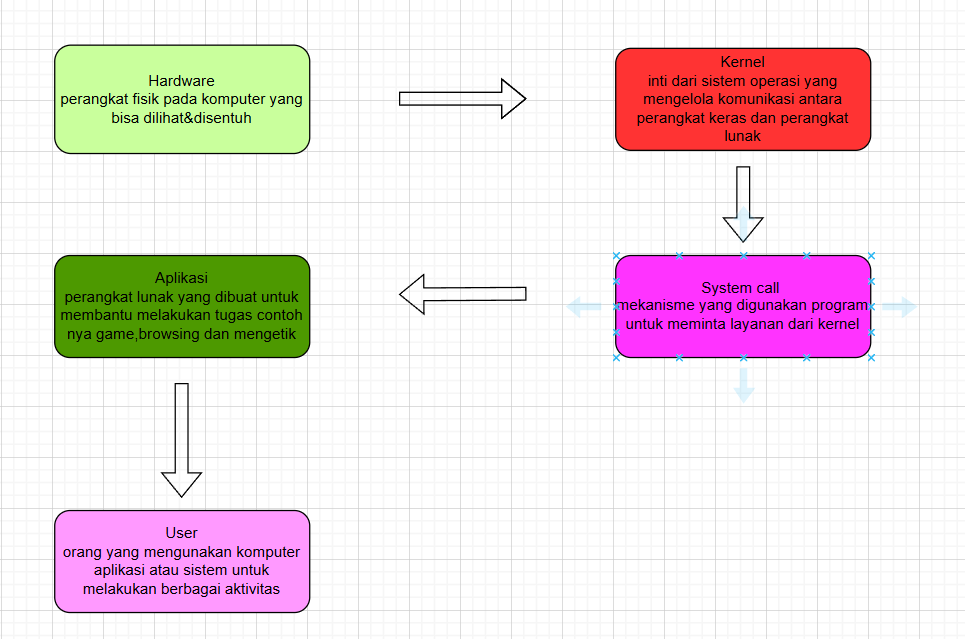
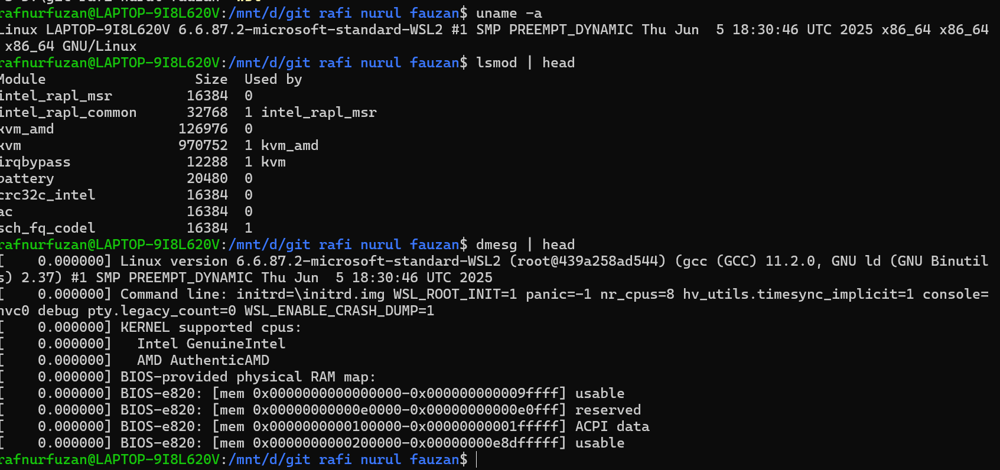

# Laporan Praktikum Minggu [X]
Topik: [mengenal microkernel,monolitik dan linux]

---

## Identitas
- **Nama**  : [Rafi nurul fauzan]  
- **NIM**   : [250202961]  
- **Kelas** : [1IKRB]

---

## Tujuan
mengenal kernel dan lapisan lapisan nya, mengetahui contoh contoh os microkernel,monolitik,hybrid dan linux  
---

## Dasar Teori
Dari materi tersebut kita jadi mengerti, semua yang kita lihat bukan lah semua, banyak hal yang kita tidak tau, bahkan yang ada ditampilkan user itu bukan semua nya, di dalam sistem tersebut ada proses bagaimana suatu hal seperti apk,file bisa berjalan, dan sesuatu yang tidak bisa dilhat user adalah kernel, kita jadi tau apa itu mode user apa itu mode kernel, teknologi akan terus berkembang, jangan menanggap kita paling tau semuanya karena itu lah sebuah penyakit bagi ilmu pengetahuan.

---

## Langkah Praktikum
1. install viscode,gitbash,ubuntu
2. buat akun github
3. fork akun 
4. kasih nama dan clone dengan cara git clone link
5. untuk up klik kanan, klik terminal lalu ketik
6. git add . git commit -m "kata kata" git push -u origin main 
7. untuk linux ada syarat syaratnya 
8. os bulid 18362 ke atas
9. setting, lalu cari update lalu update semua nya
10. setting, lalu cari developer settings dan nyalakan developer mode
11. setting, lalu cari turn windows feature dan cari windowsubsystem for linux
12. dan juga virtual machine platfrom centang dua duanya lalu restart 
13. lalu cari cmd di windows lalu commend wsl
14. cek versi ketik wsl --version pastikan versi nya 2
15. untuk melihat distribusi linux ketik wsl --list --online
16. lalu buka ubuntu masukan username dan pasword
17. jika sudah nanti ada tulisan install succesful
18. lalu ke cmd ketik wsl --list --verbose pastikan version nya 2
19. untuk kembali ke akun mu ketik wsl
20. lalu untuk mengetahui versi ubuntu ketik lsb_release -a
21. untuk mengakses keseluruhan sistem nya di akses root ketik sudo su
22. lalu ketik apt update && apt full-upgrade -y
23. tunggu sabar sampai selesai dan sudah done
24. cari cmd di windows lalu ketik wsl
25. ketik seusai tugas uname -a, ismod | head, dmesg | head 
26. ada yang ketinggalan pastikan sebelum commit&push sudah git config --global user.name "Nama Anda" , git config --global user.email "email@contoh.com"


---

## Kode / Perintah
Tuliskan potongan kode atau perintah utama:
```bash
uname -a (code/uname-a.txt)

Linux LAPTOP-9I8L620V 6.6.87.2-microsoft-standard-WSL2 #1 SMP PREEMPT_DYNAMIC Thu Jun  5 18:30:46 UTC 2025 x86_64 x86_64 x86_64 GNU/Linux

lsmod | head (code/lsmodhead.txt)

Module                  Size  Used by
intel_rapl_msr         16384  0
intel_rapl_common      32768  1 intel_rapl_msr
kvm_amd               126976  0
kvm                   970752  1 kvm_amd
irqbypass              12288  1 kvm
battery                20480  0
crc32c_intel           16384  0
ac                     16384  0
sch_fq_codel           16384  1

dmesg | head   (code/dmesghead.txt)

[    0.000000] Linux version 6.6.87.2-microsoft-standard-WSL2 (root@439a258ad544) (gcc (GCC) 11.2.0, GNU ld (GNU Binutils) 2.37) #1 SMP PREEMPT_DYNAMIC Thu Jun  5 18:30:46 UTC 2025
[    0.000000] Command line: initrd=\initrd.img WSL_ROOT_INIT=1 panic=-1 nr_cpus=8 hv_utils.timesync_implicit=1 console=hvc0 debug pty.legacy_count=0 WSL_ENABLE_CRASH_DUMP=1
[    0.000000] KERNEL supported cpus:
[    0.000000]   Intel GenuineIntel
[    0.000000]   AMD AuthenticAMD
[    0.000000] BIOS-provided physical RAM map:
[    0.000000] BIOS-e820: [mem 0x0000000000000000-0x000000000009ffff] usable
[    0.000000] BIOS-e820: [mem 0x00000000000e0000-0x00000000000e0fff] reserved
[    0.000000] BIOS-e820: [mem 0x0000000000100000-0x00000000001fffff] ACPI data
[    0.000000] BIOS-e820: [mem 0x0000000000200000-0x00000000e8dfffff] usable


```

---

## Hasil Eksekusi
Sertakan screenshot hasil percobaan atau diagram:



---

## Analisis


- jelaskan makna hasil percobaan


1. uname -a

uname -a menampilkan informasi tentang sistem operasi dan kernel yang sedang berjalan. Hasilnya:

- Nama sistem operasi (Linux)
- Versi kernel (misalnya 5.10.102.1-microsoft-standard-WSL2)
- Arsitektur prosesor (x86_64)
- Tipe prosesor (x86_64)
- Tipe sistem (GNU/Linux)

Hasil ini memberitahu bahwa kernel Linux yang sedang berjalan adalah kernel yang disediakan oleh Microsoft, yang dioptimalkan untuk berjalan di atas Windows (WSL).

2. lsmod | head

lsmod menampilkan daftar modul kernel yang sedang dimuat. Hasilnya menunjukkan beberapa modul kernel yang sedang dimuat, seperti:

- Modul kernel untuk mengelola perangkat keras (misalnya nvidia, intel)
- Modul kernel untuk mengelola sistem file (misalnya ext4,fuse)
- Modul kernel untuk mengelola jaringan (misalnya tcp, udp)

ini menunjukkan kernel Linux memiliki kemampuan untuk memuat modul kernel secara dinamis untuk mengelola berbagai aspek sistem operasi.

3. dmesg | head

dmesg menampilkan log kernel yang berisi informasi tentang proses boot dan kejadian sistem. Hasilnya menunjukkan beberapa informasi tentang:

- Proses boot kernel
- Deteksi perangkat keras
- Inisialisasi sistem file
- Inisialisasi jaringan

Hasil ini menunjukkan kernel Linux memiliki kemampuan untuk mengelola proses boot dan kejadian sistem, serta menyediakan log untuk debugging dan analisis.


- Hubungan dengan teori


Hasil percobaan menunjukkan beberapa aspek penting dari kernel Linux:

- Fungsi kernel: Kernel Linux memiliki fungsi untuk mengelola sumber daya sistem, seperti memori, CPU, dan perangkat keras.
- System call: Kernel Linux menyediakan system call untuk aplikasi untuk berinteraksi dengan kernel dan mengelola sumber daya sistem.
- Arsitektur OS: Kernel Linux memiliki arsitektur yang modular, dengan kemampuan untuk memuat modul kernel secara dinamis untuk mengelola berbagai aspek sistem operasi.


- Perbedaan hasil di lingkungan OS berbeda (Linux vs Windows)


Hasil percobaan di atas menunjukkan beberapa perbedaan antara Linux dan Windows:

- Kernel Linux memiliki kemampuan untuk memuat modul kernel secara dinamis, sedangkan Windows memiliki kernel yang lebih monolitik.
- Linux memiliki sistem file yang lebih fleksibel dan dapat di-custom, sedangkan Windows memiliki sistem file yang lebih terstruktur dan terbatas.
- Linux memiliki kemampuan untuk mengelola jaringan yang lebih luas dan dapat di-custom, sedangkan Windows memiliki kemampuan jaringan yang lebih terbatas.

tapi perbedaan antara Linux dan Windows tidak hanya terletak pada kernel, tetapi juga pada aplikasi, sistem file, dan arsitektur sistem operasi secara keseluruhan.

---

## Kesimpulan
Kernel Linux memiliki kemampuan yang luar biasa dalam mengelola sumber daya sistem, seperti memori, CPU, dan perangkat keras. linux lebih cocok bagi mereka yang ingin mengontrol sistem operasinya dan memiliki kemampuan untuk mengelola jaringan yang lebih luas.

kernel Linux merupakan pilihan yang tepat bagi mereka yang ingin memiliki sistem operasi yang fleksibel, dapat di-custom, dan memiliki kemampuan yang luas.


---

## Quiz
1. [sebutkan tiga fungsi utama sistem operasi.]  
   **mengelola dan mengatur perangkat keras komputer,menyediakan layanan,mengelola sumberdaya seperti CPU,memori dan output,input**  
2. [jelaskan perbedaan antara kernel mode dan usermode]  
   **mode kernel adalah mode sistem operasi memiliki akses penuh kesemua intruksi mode user adalah mode dengan hak terbatas dibatasi agar tidak merusak sistem**  
3. [Sebutkan contoh OS dengan arsitektur monolithic dan mikrokernel.]  
   **monolitic kernel : linux,BSD,OS/360VMX, microkernel : QNX,Symbian, L4 Linux**  

---

## Refleksi Diri
Tuliskan secara singkat:
- mengoprasikan linux sangat menantang karna berpotensi merusak laptop   
- dan cara mengatasi nya dengan melihat versi laptop dan ubuntu   

---

**Credit:**  
_Template laporan praktikum Sistem Operasi (SO-202501) – Universitas Putra Bangsa_
