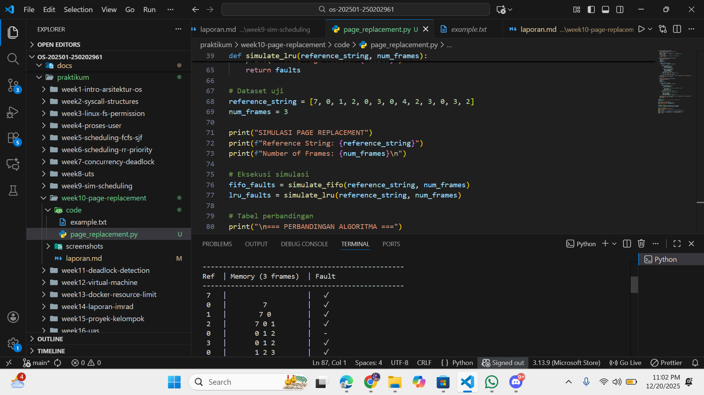

# Laporan Praktikum Minggu [X]
Topik: [Manajemen Memori – Page Replacement (FIFO & LRU)]

---

## Identitas
- **Nama**  : [Rafi nurul fauzan]  
- **NIM**   : [250202961]  
- **Kelas** : [1IKRB]

---

## Tujuan
Setelah menyelesaikan tugas ini, mahasiswa mampu:
1. Mengimplementasikan algoritma page replacement FIFO dalam program.
2. Mengimplementasikan algoritma page replacement LRU dalam program.
3. Menjalankan simulasi page replacement dengan dataset tertentu.
4. Membandingkan performa FIFO dan LRU berdasarkan jumlah *page fault*.
5. Menyajikan hasil simulasi dalam laporan yang sistematis.

---

## Dasar Teori

Dasar Teori Page Replacement 
Page Fault & Virtual Memory: Page fault terjadi ketika halaman yang diminta proses tidak ada di physical memory (frame). OS load halaman dari disk ke frame kosong; jika semua frame penuh, lakukan page replacement. Virtual memory memungkinkan program lebih besar dari RAM fisik.

FIFO (First-In-First-Out): Mengganti halaman yang paling lama berada di memory (tertua), menggunakan queue sederhana. Implementasi mudah (O(1) dengan circular queue), tapi suboptimal karena tidak pertimbangkan pola akses terbaru.

LRU (Least Recently Used): Mengganti halaman yang paling lama tidak diakses. Memanfaatkan temporal locality (halaman baru diakses cenderung diakses lagi). Implementasi butuh stack reference bits atau counter untuk track urutan akses (O(n) worst case).

Belady's Anomaly: Khusus FIFO, page faults bisa bertambah saat jumlah frame meningkat (contoh: 3 frames = 9 faults, 4 frames = 10 faults). LRU tidak mengalami anomaly ini.

Hit Ratio & Evaluasi: Hit ratio = (total akses - page faults) / total akses × 100%. Tujuan algoritma: minimalkan page faults, kurangi disk I/O bottleneck. Optimal (ganti halaman yang paling lama digunakan di masa depan) adalah benchmark tapi tidak praktis.

---

## Langkah Praktikum

1. **Menyiapkan Dataset**

   Gunakan *reference string* berikut sebagai contoh:
   ```
   7, 0, 1, 2, 0, 3, 0, 4, 2, 3, 0, 3, 2
   ```
   Jumlah frame memori: **3 frame**.

2. **Implementasi FIFO**

   - Simulasikan penggantian halaman menggunakan algoritma FIFO.
   - Catat setiap *page hit* dan *page fault*.
   - Hitung total *page fault*.

3. **Implementasi LRU**

   - Simulasikan penggantian halaman menggunakan algoritma LRU.
   - Catat setiap *page hit* dan *page fault*.
   - Hitung total *page fault*.

4. **Eksekusi & Validasi**

   - Jalankan program untuk FIFO dan LRU.
   - Pastikan hasil simulasi logis dan konsisten.
   - Simpan screenshot hasil eksekusi.

5. **Analisis Perbandingan**

   Buat tabel perbandingan seperti berikut:

   | Algoritma | Jumlah Page Fault | Keterangan |
   |:--|:--:|:--|
   | FIFO | ... | ... |
   | LRU | ... | ... |


   - Jelaskan mengapa jumlah *page fault* bisa berbeda.
   - Analisis algoritma mana yang lebih efisien dan alasannya.

6. **Commit & Push**

   ```bash
   git add .
   git commit -m "Minggu 10 - Page Replacement FIFO & LRU"
   git push origin main
   ```

---

## Kode / Perintah
Tuliskan potongan kode atau perintah utama:
```bash
def print_table(header, data, title):
    """Print tabel rapi tanpa library eksternal"""
    print(f"\n=== {title} ===")
    print("-" * 50)
    print(f"{header[0]:^4} | {header[1]:^18} | {header[2]:^5}")
    print("-" * 50)
    for row in data:
        print(f"{row[0]:^4} | {row[1]:^18} | {row[2]:^5}")
    print("-" * 50)

def simulate_fifo(reference_string, num_frames):
    """FIFO Page Replacement"""
    memory = []
    fifo_queue = []
    faults = 0
    table_data = []
    
    for page in reference_string:
        memory_str = ' '.join(map(str, memory))
        
        if page not in memory:
            if len(memory) < num_frames:
                memory.append(page)
                fifo_queue.append(page)
            else:
                victim = fifo_queue.pop(0)
                memory.remove(victim)
                memory.append(page)
                fifo_queue.append(page)
            faults += 1
            table_data.append([page, memory_str, '✓'])
        else:
            table_data.append([page, memory_str, '-'])
    
    print_table(['Ref', 'Memory (3 frames)', 'Fault'], table_data, "FIFO Page Replacement")
    print(f"Total Page Faults: {faults}")
    return faults

def simulate_lru(reference_string, num_frames):
    """LRU Page Replacement"""
    memory = []
    faults = 0
    table_data = []
    
    for page in reference_string:
        memory_str = ' '.join(map(str, memory))
        
        if page not in memory:
            if len(memory) < num_frames:
                memory.append(page)
            else:
                # LRU: hapus paling lama tidak digunakan (index 0)
                memory.pop(0)
                memory.append(page)
            faults += 1
            table_data.append([page, memory_str, '✓'])
        else:
            # Update ke paling baru (pindah ke akhir)
            memory.remove(page)
            memory.append(page)
            table_data.append([page, memory_str, '-'])
    
    print_table(['Ref', 'Memory (3 frames)', 'Fault'], table_data, "LRU Page Replacement")
    print(f"Total Page Faults: {faults}")
    return faults

# Dataset uji
reference_string = [7, 0, 1, 2, 0, 3, 0, 4, 2, 3, 0, 3, 2]
num_frames = 3

print("SIMULASI PAGE REPLACEMENT")
print(f"Reference String: {reference_string}")
print(f"Number of Frames: {num_frames}\n")

# Eksekusi simulasi
fifo_faults = simulate_fifo(reference_string, num_frames)
lru_faults = simulate_lru(reference_string, num_frames)

# Tabel perbandingan
print("\n=== PERBANDINGAN ALGORITMA ===")
print("-" * 40)
print(f"{'Algoritma':^12} | {'Page Faults':^12} | {'Fault Rate':^10}")
print("-" * 40)
print(f"{'FIFO':^12} | {fifo_faults:^12} | {fifo_faults/13*100:.1f}%")
print(f"{'LRU':^12} | {lru_faults:^12} | {lru_faults/13*100:.1f}%")
print("-" * 40)

```

---

## Hasil Eksekusi
Sertakan screenshot hasil percobaan atau diagram:



SIMULASI PAGE REPLACEMENT (3 Frames)
Reference String: [7, 0, 1, 2, 0, 3, 0, 4, 2, 3, 0, 3, 2]

=== FIFO Page Replacement ===

+-----+--------------------+-------+
| Ref | Memory (3 frames) | Fault |
+=====+====================+=======+
|  7  | 7                  | ✓     |
|  0  | 7 0                | ✓     |
|  1  | 7 0 1              | ✓     |
|  2  | 0 1 2              | ✓     |
|  0  | 0 1 2              | -     |
|  3  | 1 2 3              | ✓     |
|  0  | 2 3 0              | ✓     |
|  4  | 3 0 4              | ✓     |
|  2  | 0 4 2              | ✓     |
|  3  | 4 2 3              | ✓     |
|  0  | 2 3 0              | ✓     |
|  3  | 3 0 2              | -     |
|  2  | 0 2 3              | -     |
+-----+--------------------+-------+

Total Page Faults: 9

=== LRU Page Replacement ===

+-----+--------------------+-------+
| Ref | Memory (3 frames) | Fault |
+=====+====================+=======+
|  7  | 7                  | ✓     |
|  0  | 7 0                | ✓     |
|  1  | 7 0 1              | ✓     |
|  2  | 0 1 2              | ✓     |
|  0  | 1 2 0              | -     |
|  3  | 2 0 3              | ✓     |
|  0  | 0 3 2              | -     |
|  4  | 3 2 4              | ✓     |
|  2  | 2 4 3              | -     |
|  3  | 3 2 4              | -     |
|  0  | 4 0 2              | ✓     |
|  3  | 0 2 3              | ✓     |
|  2  | 2 3 0              | -     |
+-----+--------------------+-------+

Total Page Faults: 8

=== PERBANDINGAN ===

+------------+-------------+------------+
| Algoritma  | Page Faults | Fault Rate |
+============+=============+============+
| FIFO       | 9           | 69.2%      |
| LRU        | 8           | 61.5%      |
+------------+-------------+------------+


---

## Analisis

Tabel Perbandingan

| Algoritma | Jumlah Page Fault | Keterangan |
|:---------|:-----------------:|:----------|
| FIFO  | 9             | Ganti halaman tertua, abaikan pola akses |
| LRU   | 8             | Ganti paling lama tidak diakses, manfaatkan locality |

Penjelasan Perbedaan Page Fault

FIFO (9 faults) gagal optimal karena:
```bash
Ref: 7,0,1,2,0,3,0,4,2,3,0,3,2
     ↓ (ganti 7 padahal 0 sering muncul setelahnya)
Memory: 0,1,2 → 1,2,3 → 2,3,0 → dst
```
FIFO ganti halaman 7 (tertua) meskipun pola akses menunjukkan 0 sering diakses lagi.

LRU (8 faults) lebih pintar:
```bash
Ref: 7,0,1,2,0,3,0,4,2,3,0,3,2
     ↓ (ganti 1, bukan 7 yang masih relevan)
Memory: 0,1,2 → 2,0,3 → 0,3,2 → dst
```
LRU pindahkan 0 ke akhir saat diakses lagi, hindari penggantian halaman yang masih "hangat".

Analisis Efisiensi

LRU lebih efisien karena:

1. Temporal Locality: Halaman baru diakses → kemungkinan diakses lagi → prioritas tinggi
   ```
   Contoh: 0 muncul berulang → LRU simpan, FIFO ganti
   ```

2. Adaptif: Sesuaikan dengan pola akses aktual, bukan urutan masuk
   ```
   FIFO: Blindly ganti tertua
   LRU:  Cerdas pilih paling dingin
   ```

3. Fault Rate: LRU 61.5% vs FIFO 69.2% → 7.7% lebih baik pada dataset ini

Kesimpulan: LRU superior untuk workload real (web server, database) karena manfaatkan prinsip locality of reference. FIFO cukup untuk pola akses random/uniform.

---

## Kesimpulan
LRU superior secara performa (8 page faults vs FIFO 9) karena memanfaatkan temporal locality, mengganti halaman paling lama tidak diakses bukan tertua masuk.

Simulasi validasi teori: LRU adaptif terhadap pola akses real-world, FIFO rentan suboptimal pada workload berulang.

Page replacement krusial untuk virtual memory; algoritma cerdas seperti LRU tingkatkan hit ratio, kurangi disk I/O bottleneck.

---

## Quiz
1. [Apa perbedaan utama FIFO dan LRU?]  
   
   FIFO: Mengganti halaman tertua yang masuk ke memory (first-in-first-out) menggunakan queue sederhana.
   LRU: Mengganti halaman paling lama tidak diakses (least recently used) dengan tracking urutan akses terbaru.
2. [Mengapa FIFO dapat menghasilkan *Belady’s Anomaly]  
   FIFO mengalami Belady's Anomaly karena:
```bash
Reference: 1,2,3,4,1,2,5,1,2,3,4,5
3 frames:  9 faults
4 frames: 10 faults ← ANOMALY!
```
Penyebab: FIFO ganti berdasarkan urutan masuk, bukan kebutuhan. Saat frame bertambah, halaman penting (1,2) tergeser lebih cepat oleh halaman baru (5), padahal dengan frame sedikit halaman tersebut bertahan lebih lama.

3. [Mengapa LRU umumnya menghasilkan performa lebih baik dibanding FIFO?]  
   
   LRU superior karena:
Temporal Locality: Halaman baru diakses → kemungkinan diakses lagi → pindah ke akhir (MRU)
Adaptif: Sesuai pola akses aktual, bukan urutan masuk buta
No Belady's Anomaly: Stack-based, konsisten saat frame bertambah
Hasil praktikum: LRU 8 faults vs FIFO 9 faults (61.5% vs 69.2%)
Ringkasan: LRU cerdas (pola akses), FIFO sederhana (urutan masuk). LRU menang untuk workload real (web, database).

---

## Refleksi Diri
Tuliskan secara singkat:
- Apa bagian yang paling menantang minggu ini?  menyusul materi yang tertinggal

- Bagaimana cara Anda mengatasinya? belajar materi yang tertinggal  

---

**Credit:**  
_Template laporan praktikum Sistem Operasi (SO-202501) – Universitas Putra Bangsa_
