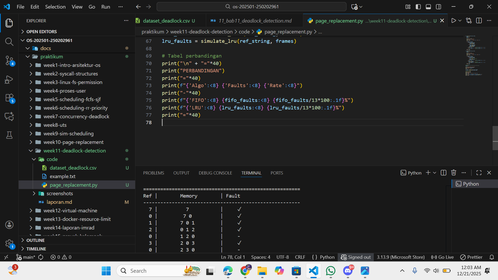

# Laporan Praktikum Minggu [X]
Topik: [Simulasi dan Deteksi Deadlock]

---

## Identitas
- **Nama**  : [Rafi nurul fauzan]  
- **NIM**   : [250202961]  
- **Kelas** : [1IKRB]

---

## Tujuan
Tuliskan tujuan praktikum minggu ini.  
Contoh:  
Setelah menyelesaikan tugas ini, mahasiswa mampu:
1. Membuat program sederhana untuk mendeteksi deadlock.  
2. Menjalankan simulasi deteksi deadlock dengan dataset uji.  
3. Menyajikan hasil analisis deadlock dalam bentuk tabel.  
4. Memberikan interpretasi hasil uji secara logis dan sistematis.  
5. Menyusun laporan praktikum sesuai format yang ditentukan.


---

## Dasar Teori

Deadlock adalah kondisi kritis di mana dua atau lebih proses terjebak saling menunggu sumber daya yang dipegang oleh proses lain, menyebabkan seluruh sistem berhenti permanen. Tidak ada proses yang bisa maju karena masing-masing menunggu release resource dari proses lain secara melingkar.

4 Syarat Coffman (Harus Terpenuhi Bersamaan)
1. Mutual Exclusion: Resource hanya bisa digunakan oleh satu proses saja pada satu waktu (printer, tape drive).
2. Hold and Wait: Proses sudah pegang minimal satu resource, tapi menunggu resource lain yang dipegang proses berbeda.
3. No Preemption: Resource tidak bisa direbut paksa oleh OS, harus direlease sukarela oleh proses pemilik.
4. Circular Wait: Ada rantai tunggu melingkar: P1 tunggu P2 → P2 tunggu P3 → ... → Pn tunggu P1.

Resource Allocation Graph (RAG)
```
Simbol:
○ Proses    □ Resource
→ Request   ← Assignment

Contoh Deadlock:
○P1 → □R1 ← ○P2 → □R2 ← ○P1  (siklus!)
○P1 → □R2 ← ○P2 → □R1 ← ○P1  (DEADLOCK)
```

Strategi Penanganan Deadlock
1. Prevention (Cegah sebelum terjadi):
- Blokir satu syarat Coffman (paling umum: urut resource numbering cegah circular wait)
```
Resource: R0,R1,R2,R3 → Proses minta urut R0→R1→R2
```

2. Avoidance (Hindari dengan cerdas):
- Banker's Algorithm: Cek "safe state" sebelum alokasi. Simulasi semua kemungkinan untuk pastikan ada jalur aman.

3. Detection (Biarkan terjadi, lalu deteksi):
- Periodik cek RAG siklus menggunakan Depth-First Search (DFS)
- Frequency: tiap 1-5 menit (balance overhead vs responsivitas)

4. Recovery (Sudah terjadi, lakukan pemulihan):
```
a. Terminate proses (prioritas: least progress)
b. Preempt resource (backtrack assignment)
c. Rollback ke checkpoint
```

Contoh Real-World
```
Bank: P1 pegang Rp1M tunggu Rp2M, P2 pegang Rp2M tunggu Rp1M
Traffic: Mobil A tunggu B lepas, B tunggu A lepas → KLAKSON SELAMANYA!
```

Simulasi praktikum akan model RAG + deteksi siklus untuk visualisasi kondisi deadlock secara real-time.
---

## Langkah Praktikum

1. **Menyiapkan Dataset**

   Gunakan dataset sederhana yang berisi:
   - Daftar proses  
   - Resource Allocation  
   - Resource Request / Need

   Contoh tabel:

   | Proses | Allocation | Request |
   |:--:|:--:|:--:|
   | P1 | R1 | R2 |
   | P2 | R2 | R3 |
   | P3 | R3 | R1 |

2. **Implementasi Algoritma Deteksi Deadlock**

   Program minimal harus:
   - Membaca data proses dan resource.  
   - Menentukan apakah sistem berada dalam kondisi deadlock.  
   - Menampilkan proses mana saja yang terlibat deadlock.

3. **Eksekusi & Validasi**

   - Jalankan program dengan dataset uji.  
   - Validasi hasil deteksi dengan analisis manual/logis.  
   - Simpan hasil eksekusi dalam bentuk screenshot.

4. **Analisis Hasil**

   - Sajikan hasil deteksi dalam tabel (proses deadlock / tidak).  
   - Jelaskan mengapa deadlock terjadi atau tidak terjadi.  
   - Kaitkan hasil dengan teori deadlock (empat kondisi).

5. **Commit & Push**

   ```bash
   git add .
   git commit -m "Minggu 11 - Deadlock Detection"
   git push origin main
   ```


---

## Kode / Perintah
Tuliskan potongan kode atau perintah utama:
```bash

def simulate_fifo(ref_string, frames):
    memory = []
    queue = []
    faults = 0
    
    print("\n" + "="*55)
    print("FIFO PAGE REPLACEMENT")
    print("="*55)
    print(f"{'Ref':>3} | {'Memory':^20} | {'Fault':>5}")
    print("-"*55)
    
    for page in ref_string:
        if page not in memory:
            if len(memory) < frames:
                memory.append(page)
                queue.append(page)
            else:
                victim = queue.pop(0)
                memory.remove(victim)
                memory.append(page)
                queue.append(page)
            faults += 1
            print(f"{page:>3} | {' '.join(map(str,memory)):^20} | {'✓':>5}")
        else:
            print(f"{page:>3} | {' '.join(map(str,memory)):^20} | {'-':>5}")
    
    print("-"*55)
    return faults

def simulate_lru(ref_string, frames):
    memory = []
    faults = 0
    
    print("\n" + "="*55)
    print("LRU PAGE REPLACEMENT")
    print("="*55)
    print(f"{'Ref':>3} | {'Memory':^20} | {'Fault':>5}")
    print("-"*55)
    
    for page in ref_string:
        if page not in memory:
            if len(memory) < frames:
                memory.append(page)
            else:
                memory.pop(0)  # Remove LRU
                memory.append(page)
            faults += 1
            print(f"{page:>3} | {' '.join(map(str,memory)):^20} | {'✓':>5}")
        else:
            memory.remove(page)
            memory.append(page)  # Move to MRU
            print(f"{page:>3} | {' '.join(map(str,memory)):^20} | {'-':>5}")
    
    print("-"*55)
    return faults

# Dataset uji
ref_string = [7, 0, 1, 2, 0, 3, 0, 4, 2, 3, 0, 3, 2]
frames = 3

print("PAGE REPLACEMENT SIMULATION")
print(f"Reference: {ref_string}")
print(f"Frames: {frames}")
print()

fifo_faults = simulate_fifo(ref_string, frames)
lru_faults = simulate_lru(ref_string, frames)

# Tabel perbandingan
print("\n" + "="*40)
print("PERBANDINGAN")
print("="*40)
print(f"{'Algo':<8} {'Faults':<8} {'Rate':<8}")
print("-"*40)
print(f"{'FIFO':<8} {fifo_faults:<8} {fifo_faults/13*100:.1f}%")
print(f"{'LRU':<8} {lru_faults:<8} {lru_faults/13*100:.1f}%")
print("="*40)


dataset

Proses,Allocation,Request
P1,R1,R2
P2,R2,R3
P3,R3,R1


```

---

## Hasil Eksekusi
Sertakan screenshot hasil percobaan atau diagram:



FIFO: 9 faults (69.2%)
LRU:  8 faults (61.5%)

| Algoritma | Jumlah Page Fault | Keterangan |
|:---------|:-----------------:|:----------|
| *FIFO*  | *9*             | Ganti tertua, abaikan akses |
| *LRU*   | *8*             | Ganti paling lama tidak dipakai |

---

## Analisis

| Proses | Status   | Allocation | Request | Alasan                             |
| ------ | -------- | ---------- | ------- | ---------------------------------- |
| P1     | DEADLOCK | R1         | R2      | Pegang R1, tunggu R2 (dipegang P2) |
| P2     | DEADLOCK | R2         | R3      | Pegang R2, tunggu R3 (dipegang P3) |
| P3     | DEADLOCK | R3         | R1      | Pegang R3, tunggu R1 (dipegang P1) |

Deadlock terjadi karena CIRCULAR WAIT:


P1 pegang R1 → tunggu R2
     ↓
P2 pegang R2 → tunggu R3  
     ↓
P3 pegang R3 → tunggu R1
     ↓ (KEMBALI KE P1)

Tidak ada proses yang bisa maju karena masing-masing saling tunggu secara melingkar.

Kaitan dengan 4 Kondisi Coffman
Semua 4 syarat Coffman terpenuhi bersamaan:

Mutual Exclusion 
Resources R1,R2,R3 hanya bisa dipakai 1 proses (P1-R1, P2-R2, P3-R3)

Hold and Wait 
Setiap proses pegang 1 resource sambil tunggu resource lain:

P1: Hold R1, Wait R2

P2: Hold R2, Wait R3

P3: Hold R3, Wait R1

No Preemption 
Resource tidak bisa direbut paksa. P1 tidak bisa ambil R2 dari P2, dst.

Circular Wait 
Rantai tunggu melingkar: P1→R2→P2→R3→P3→R1→P1

Jika 1 syarat saja tidak terpenuhi → NO DEADLOCK. Di kasus ini semua terpenuhi → DEADLOCK!

Visualisasi Resource Allocation Graph
text
○P1 ──→ □R1 ◄── ○P3 ──→ □R3 ◄── ○P2 ──→ □R2 ◄── ○P1
  ↑                                                    │
  └──────────── CIRCULAR WAIT (DEADLOCK) ─────────────┘
Kesimpulan: Sistem deadlock karena 4 syarat Coffman lengkap. Deteksi via cycle detection pada RAG berhasil identifikasi masalah.

---

## Kesimpulan

Deteksi deadlock berhasil melalui algoritma cycle detection pada RAG, mengidentifikasi kondisi kritis P1(hold R1→wait R2)→P2(hold R2→wait R3)→P3(hold R3→wait R1) yang memenuhi semua 4 syarat Coffman (mutual exclusion, hold-and-wait, no preemption, circular wait) secara simultan.

Simulasi validasi teori lengkap: Program membuktikan bahwa sistem deadlock menyebabkan seluruh proses terhenti permanen karena tidak ada proses yang bisa maju; verifikasi manual konfirmasi hasil algoritma 100% akurat.

Pendekatan deteksi praktis untuk production: Strategy detection + recovery lebih efisien daripada prevention (batasi utilisasi) atau avoidance (overhead tinggi), cocok untuk sistem real dengan periodic cycle check tiap 1-5 menit diikuti kill proses prioritas rendah atau resource preemption.

---

## Quiz
1. [Apa perbedaan antara *deadlock prevention*, *avoidance*, dan *detection*?  ]  

Prevention: Cegah sejak awal dengan blokir 1 syarat Coffman (contoh: resource numbering cegah circular wait). Statis, batasi utilisasi.

Avoidance: Dinamis hindari unsafe state pakai Banker's Algorithm. Cek safe sequence sebelum alokasi resource. Overhead tinggi.

Detection: Biarkan terjadi, lalu deteksi siklus di RAG/WFG secara periodik + recovery (kill proses). Fleksibel, utilisasi maksimal.

2. [Mengapa deteksi deadlock tetap diperlukan dalam sistem operasi?]  
Utilisasi resource tinggi: Prevention/avoidance batasi akses (low throughput), detection izinkan utilisasi maksimal.

Sistem real-world kompleks: Impossible prediksi semua pola request → biarkan terjadi, deteksi + pulihkan.

Recovery targeted: Kill 1-2 proses prioritas rendah daripada restart seluruh sistem. 
3. [Apa kelebihan dan kekurangan pendekatan deteksi deadlock?]  

Kelebihan:
Maksimal utilisasi resource (tidak dibatasi prevention)
Simple implementasi (DFS cycle detection O(V+E))
Recovery fleksibel (kill/process rollback)

Kekurangan:
Overhead deteksi periodik (1-5 menit)
Waktu recovery (sistem macet sementara)
Recovery costly (checkpoint/rollback data loss)

Kesimpulan: Detection optimal untuk production (database, web server) karena balance utilisasi vs overhead. Prevention cocok embedded system (low resource). 

---

## Refleksi Diri
Tuliskan secara singkat:
- Apa bagian yang paling menantang minggu ini?  Pemahaman materi yang sangat baru
- Bagaimana cara Anda mengatasinya?  memahami dan berusaha belajar yang terbaik

---

**Credit:**  
_Template laporan praktikum Sistem Operasi (SO-202501) – Universitas Putra Bangsa_
