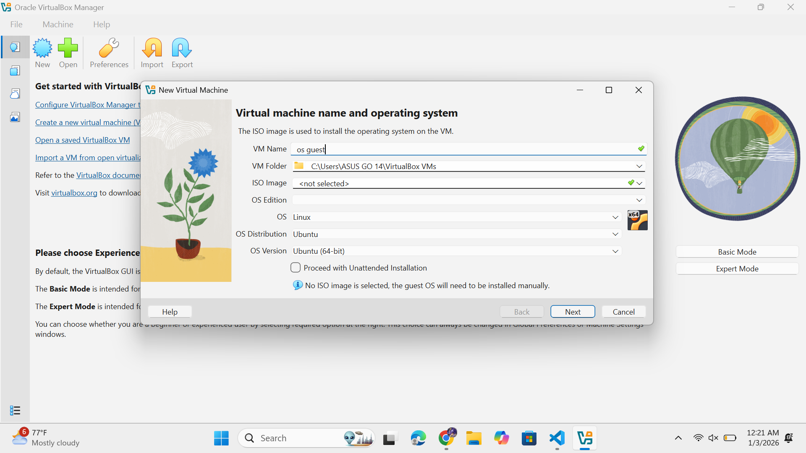
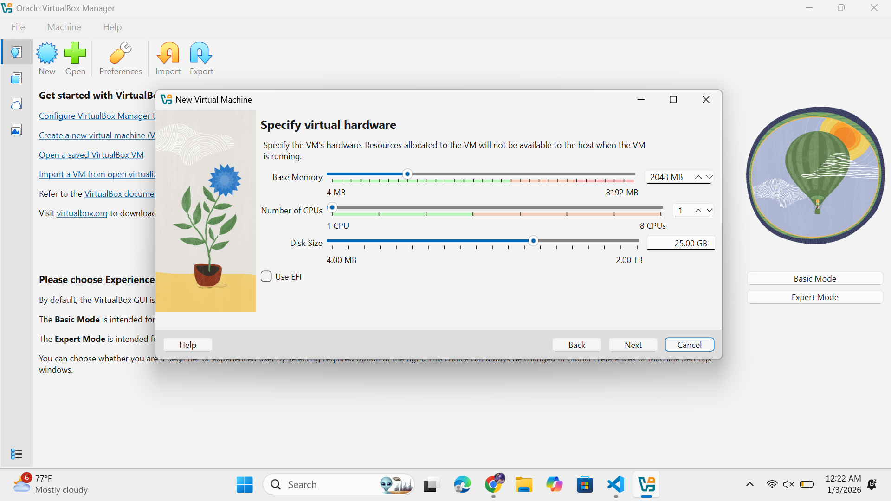
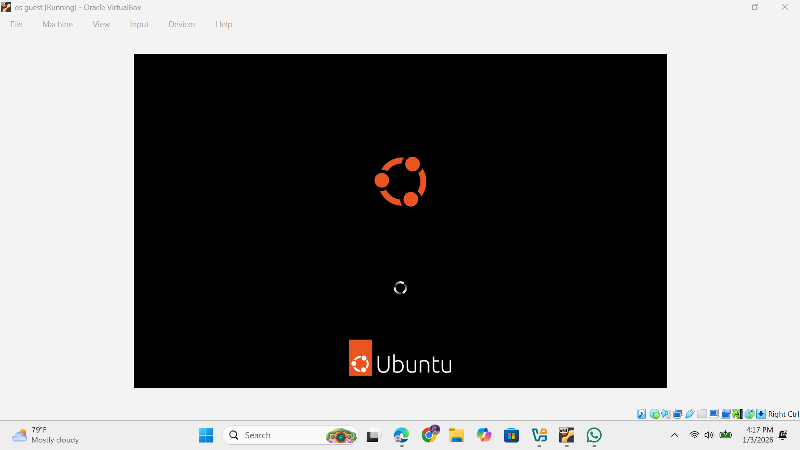
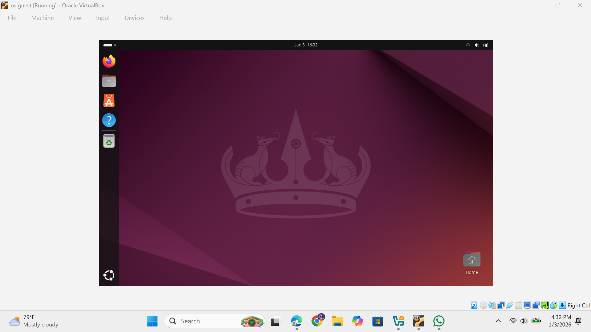
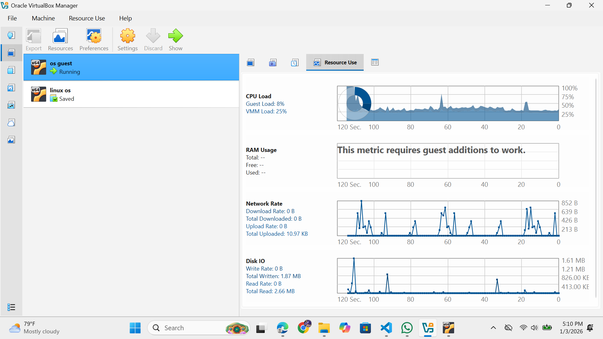

# Laporan Praktikum Minggu [X]
Topik: [Virtualisasi Menggunakan Virtual Machine]

---

## Identitas
- **Nama**  : [Rafi nurul fauzan]  
- **NIM**   : [(250202961)]  
- **Kelas** : [1IKRB]

---

## Tujuan
Tuliskan tujuan praktikum minggu ini.  
Setelah menyelesaikan tugas ini, mahasiswa mampu:
1. Menginstal perangkat lunak virtualisasi (VirtualBox/VMware).  
2. Membuat dan menjalankan sistem operasi guest di dalam VM.  
3. Mengatur konfigurasi resource VM (CPU, RAM, storage).  
4. Menjelaskan mekanisme proteksi OS melalui virtualisasi.  
5. Menyusun laporan praktikum instalasi dan konfigurasi VM secara sistematis.


---

## Dasar Teori
Virtualisasi menggunakan Virtual Machine (VM) merupakan teknologi yang memungkinkan satu perangkat keras fisik menjalankan beberapa sistem operasi secara terpisah seolah-olah masing-masing beroperasi pada komputer independen. Konsep ini mengoptimalkan pemanfaatan sumber daya seperti CPU, memori, dan penyimpanan melalui pembagian yang efisien.
​

Komponen Utama
Hypervisor menjadi elemen inti yang mengelola alokasi sumber daya fisik ke berbagai VM, memastikan isolasi antar-VM agar tidak saling mengganggu. Komponen lain mencakup RAM virtual untuk mendukung aplikasi dalam VM, serta penyimpanan virtual berupa file besar yang menyerupai hard drive fisik.
​

Cara Kerja
Hypervisor menciptakan lapisan abstraksi di atas perangkat keras, membagi prosesor menjadi unit virtual dan mendistribusikan memori serta storage ke sistem operasi tamu (guest OS). Pendekatan berlapis ini membuat aplikasi dalam VM merasa memiliki akses penuh ke perangkat keras, meskipun sumber daya dibagi dengan VM lain.
​

Manfaat Utama
VM meningkatkan efisiensi dengan mengurangi kebutuhan perangkat fisik, menyederhanakan skalabilitas aplikasi, dan memperkuat keamanan melalui isolasi yang mencegah penyebaran malware. Teknologi ini juga meminimalkan downtime karena VM dapat dipindahkan antar-hypervisor dengan mudah.


---

## Langkah Praktikum

1. **Instalasi Virtual Machine**
   - Instal VirtualBox atau VMware pada komputer host.  
   - Pastikan fitur virtualisasi (VT-x / AMD-V) aktif di BIOS.

2. **Pembuatan OS Guest**
   - Buat VM baru dan pilih OS guest (misal: Ubuntu Linux).  
   - Atur resource awal:
     - CPU: 1–2 core  
     - RAM: 2–4 GB  
     - Storage: ≥ 20 GB

3. **Instalasi Sistem Operasi**
   - Jalankan proses instalasi OS guest sampai selesai.  
   - Pastikan OS guest dapat login dan berjalan normal.

4. **Konfigurasi Resource**
   - Ubah konfigurasi CPU dan RAM.  
   - Amati perbedaan performa sebelum dan sesudah perubahan resource.

5. **Analisis Proteksi OS**
   - Jelaskan bagaimana VM menyediakan isolasi antara host dan guest.  
   - Kaitkan dengan konsep *sandboxing* dan *hardening* OS.

6. **Dokumentasi**
   - Ambil screenshot setiap tahap penting.  
   - Simpan di folder `screenshots/`.

7. **Commit & Push**
   ```bash
   git add .
   git commit -m "Minggu 12 - Virtual Machine"
   git push origin main
   ```
---

## Kode / Perintah
Tuliskan potongan kode atau perintah utama:
```bash
1. Instal dan jalankan OS guest menggunakan VM.  
2. Konfigurasikan resource VM sesuai instruksi.  
3. Dokumentasikan proses instalasi dan konfigurasi.  
4. Tulis laporan praktikum pada `laporan.md`.

```

---

## Hasil Eksekusi
Sertakan screenshot hasil percobaan atau diagram:










---

## Analisis

Host OS berfungsi sebagai fondasi fisik yang menangani akses langsung ke hardware, sehingga lebih rentan terhadap kegagalan total jika overload, sementara Guest OS terlindungi dalam sandbox virtual yang memungkinkan restart independen tanpa memengaruhi sistem utama. Perbedaan ini menciptakan ketahanan hierarkis, di mana Guest OS bisa diuji atau dihapus tanpa risiko bagi infrastruktur keseluruhan, meskipun menambah overhead performa sekitar 5-15% akibat abstraksi.

---

## Kesimpulan
Efisiensi Sumber Daya: VM memaksimalkan utilisasi hardware hingga 80% melalui pembagian dinamis CPU, memori, dan storage oleh hypervisor, mengurangi biaya operasional server fisik secara signifikan.


Keamanan Terisolasi: Pemisahan ketat antar-Guest OS mencegah penyebaran malware dan mendukung snapshot cepat untuk pemulihan, meski butuh update hypervisor rutin.


Skalabilitas Tinggi: Migrasi live dan overcommitment sumber daya memungkinkan ekspansi tanpa downtime, menjadikan VM tulang punggung cloud modern.


---

## Quiz
1. [Apa perbedaan antara host OS dan guest OS?]  
   Jawaban: Host OS merupakan sistem operasi yang langsung berinteraksi dengan perangkat keras fisik untuk mengatur pembagian sumber daya seperti prosesor dan memori bagi berbagai VM, berbeda dengan Guest OS yang hanya menjalankan tugas di lingkungan virtual terbatas. Host OS mengendalikan infrastruktur keseluruhan, sementara Guest OS terbatas pada sumber daya buatan yang diberikan kepadanya.
.

2. [Apa peran hypervisor dalam virtualisasi?]  
   Jawaban: Hypervisor bertugas sebagai perantara utama yang membentuk serta mengendalikan VM dengan mendistribusikan sumber daya fisik secara terisolasi ke Guest OS masing-masing. Selain itu, hypervisor menyediakan simulasi perangkat keras agar Guest OS dapat berfungsi seolah-olah memiliki akses fisik penuh.
  
3. [Mengapa virtualisasi meningkatkan keamanan sistem?]  
   Jawaban: Virtualisasi memperkuat perlindungan sistem lewat pemisahan ketat antar-VM, sehingga ancaman di satu VM tidak dapat menjangkau VM lain atau Host OS, ideal untuk uji coba perangkat lunak berpotensi berbahaya. Kemampuan snapshot dan pemulihan cepat VM juga meminimalkan dampak serangan tanpa mengganggu operasional utama.  

---

## Refleksi Diri
Tuliskan secara singkat:
- Apa bagian yang paling menantang minggu ini?memahami dan belajar mengenai operasi sistem  
- Bagaimana cara Anda mengatasinya?  belajar dan selalu mencari tau hal baru

---

**Credit:**  
_Template laporan praktikum Sistem Operasi (SO-202501) – Universitas Putra Bangsa_
