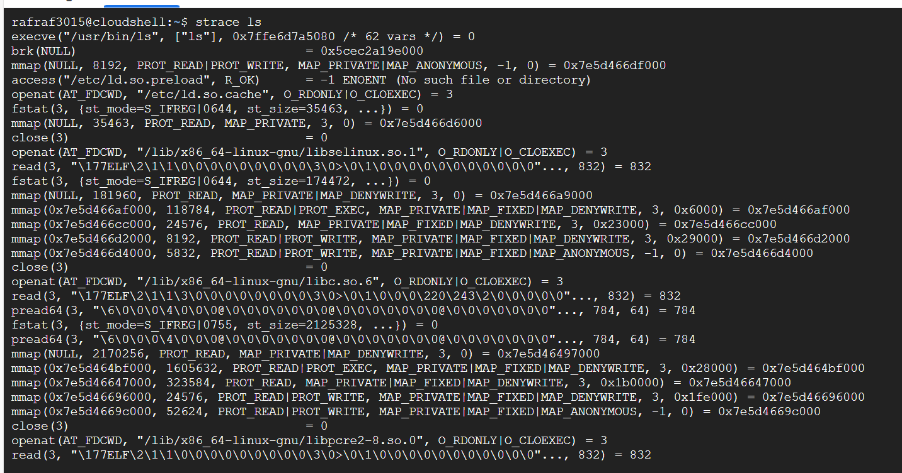

# Laporan Praktikum Minggu [X]
Topik: [Struktur System Call dan Fungsi kernel]

---

## Identitas
- **Nama**  : [Rafi nurul fauzan]  
- **NIM**   : [250202961]  
- **Kelas** : [1IKRB]

---

## Tujuan
> mengenal tentang system call, mempelajari mekanisme system call dan mampu mengunakan linux untuk menampilakn dan menganalisa system call
---

## Dasar Teori
- System call adalah antarmuka antara program dan kernel yang memungkinkan aplikasi berinteraksi dengan perangkat keras secara aman melalui layanan os

- Struktur Sistem Operasi adalah Sistem operasi memiliki struktur yang kompleks, tetapi dapat dibagi menjadi beberapa komponen utama, seperti kernel, system call interface, device driver, file system, dan process management.

-  Kernel: Kernel adalah inti sistem operasi yang mengelola sumber daya sistem dan menyediakan layanan ke aplikasi.

-  Model Arsitektur Sistem Operasi adalah Sistem operasi dapat memiliki beberapa model arsitektur, seperti monolithic kernel, microkernel, dan layered architecture.

- Fungsi Sistem Operasi adalah Sistem operasi memiliki beberapa fungsi, seperti mengelola proses, mengelola memori, mengelola file, dan menyediakan layanan ke aplikasi.

---

## Langkah Praktikum
1. masuk kedalam ubuntu lalu install perintah starce dan man
2. jalan kan perintah strace ls, strace -e trace=open,read,write,close cat /etc/passwd , dmesg | tail -n 10
3. lalu analisa lah perintah perintah tersebut
4. lalu buat diagram alur system call dari user ke kernel lalu kembali ke user mengunakan draw.oi
5. lalu up dengan cara git add ., git commit -m "week2", git push -u origin main

---

## Kode / Perintah

```bash
strace ls

execve("/usr/bin/ls", ["ls"], 0x7ffe6d7a5080 /* 62 vars */) = 0
brk(NULL)                               = 0x5cec2a19e000
mmap(NULL, 8192, PROT_READ|PROT_WRITE, MAP_PRIVATE|MAP_ANONYMOUS, -1, 0) = 0x7e5d466df000
access("/etc/ld.so.preload", R_OK)      = -1 ENOENT (No such file or directory)
openat(AT_FDCWD, "/etc/ld.so.cache", O_RDONLY|O_CLOEXEC) = 3
fstat(3, {st_mode=S_IFREG|0644, st_size=35463, ...}) = 0
mmap(NULL, 35463, PROT_READ, MAP_PRIVATE, 3, 0) = 0x7e5d466d6000
close(3)                                = 0
openat(AT_FDCWD, "/lib/x86_64-linux-gnu/libselinux.so.1", O_RDONLY|O_CLOEXEC) = 3
read(3, "\177ELF\2\1\1\0\0\0\0\0\0\0\0\0\3\0>\0\1\0\0\0\0\0\0\0\0\0\0\0"..., 832) = 832
fstat(3, {st_mode=S_IFREG|0644, st_size=174472, ...}) = 0
mmap(NULL, 181960, PROT_READ, MAP_PRIVATE|MAP_DENYWRITE, 3, 0) = 0x7e5d466a9000
mmap(0x7e5d466af000, 118784, PROT_READ|PROT_EXEC, MAP_PRIVATE|MAP_FIXED|MAP_DENYWRITE, 3, 0x6000) = 0x7e5d466af000
mmap(0x7e5d466cc000, 24576, PROT_READ, MAP_PRIVATE|MAP_FIXED|MAP_DENYWRITE, 3, 0x23000) = 0x7e5d466cc000
mmap(0x7e5d466d2000, 8192, PROT_READ|PROT_WRITE, MAP_PRIVATE|MAP_FIXED|MAP_DENYWRITE, 3, 0x29000) = 0x7e5d466d2000
mmap(0x7e5d466d4000, 5832, PROT_READ|PROT_WRITE, MAP_PRIVATE|MAP_FIXED|MAP_ANONYMOUS, -1, 0) = 0x7e5d466d4000
close(3)                                = 0
openat(AT_FDCWD, "/lib/x86_64-linux-gnu/libc.so.6", O_RDONLY|O_CLOEXEC) = 3
read(3, "\177ELF\2\1\1\3\0\0\0\0\0\0\0\0\3\0>\0\1\0\0\0\220\243\2\0\0\0\0\0"..., 832) = 832
pread64(3, "\6\0\0\0\4\0\0\0@\0\0\0\0\0\0\0@\0\0\0\0\0\0\0@\0\0\0\0\0\0\0"..., 784, 64) = 784
fstat(3, {st_mode=S_IFREG|0755, st_size=2125328, ...}) = 0
pread64(3, "\6\0\0\0\4\0\0\0@\0\0\0\0\0\0\0@\0\0\0\0\0\0\0@\0\0\0\0\0\0\0"..., 784, 64) = 784
mmap(NULL, 2170256, PROT_READ, MAP_PRIVATE|MAP_DENYWRITE, 3, 0) = 0x7e5d46497000
mmap(0x7e5d464bf000, 1605632, PROT_READ|PROT_EXEC, MAP_PRIVATE|MAP_FIXED|MAP_DENYWRITE, 3, 0x28000) = 0x7e5d464bf000
mmap(0x7e5d46647000, 323584, PROT_READ, MAP_PRIVATE|MAP_FIXED|MAP_DENYWRITE, 3, 0x1b0000) = 0x7e5d46647000
mmap(0x7e5d46696000, 24576, PROT_READ|PROT_WRITE, MAP_PRIVATE|MAP_FIXED|MAP_DENYWRITE, 3, 0x1fe000) = 0x7e5d46696000
mmap(0x7e5d4669c000, 52624, PROT_READ|PROT_WRITE, MAP_PRIVATE|MAP_FIXED|MAP_ANONYMOUS, -1, 0) = 0x7e5d4669c000
close(3)                                = 0
openat(AT_FDCWD, "/lib/x86_64-linux-gnu/libpcre2-8.so.0", O_RDONLY|O_CLOEXEC) = 3
read(3, "\177ELF\2\1\1\0\0\0\0\0\0\0\0\0\3\0>\0\1\0\0\0\0\0\0\0\0\0\0\0"..., 832) = 832
fstat(3, {st_mode=S_IFREG|0644, st_size=625344, ...}) = 0
mmap(NULL, 627472, PROT_READ, MAP_PRIVATE|MAP_DENYWRITE, 3, 0) = 0x7e5d463fd000
mmap(0x7e5d463ff000, 450560, PROT_READ|PROT_EXEC, MAP_PRIVATE|MAP_FIXED|MAP_DENYWRITE, 3, 0x2000) = 0x7e5d463ff000
mmap(0x7e5d4646d000, 163840, PROT_READ, MAP_PRIVATE|MAP_FIXED|MAP_DENYWRITE, 3, 0x70000) = 0x7e5d4646d000
mmap(0x7e5d46495000, 8192, PROT_READ|PROT_WRITE, MAP_PRIVATE|MAP_FIXED|MAP_DENYWRITE, 3, 0x97000) = 0x7e5d46495000
close(3)                                = 0
mmap(NULL, 12288, PROT_READ|PROT_WRITE, MAP_PRIVATE|MAP_ANONYMOUS, -1, 0) = 0x7e5d463fa000
arch_prctl(ARCH_SET_FS, 0x7e5d463fa800) = 0
set_tid_address(0x7e5d463faad0)         = 1680
set_robust_list(0x7e5d463faae0, 24)     = 0
rseq(0x7e5d463fb120, 0x20, 0, 0x53053053) = 0
mprotect(0x7e5d46696000, 16384, PROT_READ) = 0
mprotect(0x7e5d46495000, 4096, PROT_READ) = 0
mprotect(0x7e5d466d2000, 4096, PROT_READ) = 0
mprotect(0x5cebf70aa000, 8192, PROT_READ) = 0
mprotect(0x7e5d46717000, 8192, PROT_READ) = 0
prlimit64(0, RLIMIT_STACK, NULL, {rlim_cur=8192*1024, rlim_max=RLIM64_INFINITY}) = 0
munmap(0x7e5d466d6000, 35463)           = 0
statfs("/sys/fs/selinux", 0x7ffe575c3240) = -1 ENOENT (No such file or directory)
statfs("/selinux", 0x7ffe575c3240)      = -1 ENOENT (No such file or directory)
getrandom("\x29\xfa\x2c\x0e\xde\x40\xcb\xd2", 8, GRND_NONBLOCK) = 8
brk(NULL)                               = 0x5cec2a19e000
brk(0x5cec2a1bf000)                     = 0x5cec2a1bf000
openat(AT_FDCWD, "/proc/filesystems", O_RDONLY|O_CLOEXEC) = 3
fstat(3, {st_mode=S_IFREG|0444, st_size=0, ...}) = 0
read(3, "nodev\tsysfs\nnodev\ttmpfs\nnodev\tbd"..., 1024) = 390
read(3, "", 1024)                       = 0
close(3)                                = 0
access("/etc/selinux/config", F_OK)     = -1 ENOENT (No such file or directory)
openat(AT_FDCWD, "/usr/lib/locale/locale-archive", O_RDONLY|O_CLOEXEC) = 3
fstat(3, {st_mode=S_IFREG|0644, st_size=3055776, ...}) = 0
mmap(NULL, 3055776, PROT_READ, MAP_PRIVATE, 3, 0) = 0x7e5d4610f000
close(3)                                = 0
ioctl(1, TCGETS, {c_iflag=ICRNL|IXON|IUTF8, c_oflag=NL0|CR0|TAB0|BS0|VT0|FF0|OPOST|ONLCR, c_cflag=B38400|CS8|CREAD, c_lflag=ISIG|ICANON|ECHO|ECHOE|ECHOK|IEXTEN|ECHOCTL|ECHOKE, ...}) = 0
ioctl(1, TIOCGWINSZ, {ws_row=8, ws_col=159, ws_xpixel=0, ws_ypixel=0}) = 0
openat(AT_FDCWD, ".", O_RDONLY|O_NONBLOCK|O_CLOEXEC|O_DIRECTORY) = 3
fstat(3, {st_mode=S_IFDIR|0750, st_size=4096, ...}) = 0
getdents64(3, 0x5cec2a1a4ce0 /* 15 entries */, 32768) = 496
getdents64(3, 0x5cec2a1a4ce0 /* 0 entries */, 32768) = 0
close(3)                                = 0
fstat(1, {st_mode=S_IFCHR|0620, st_rdev=makedev(0x88, 0x2), ...}) = 0
write(1, "README-cloudshell.txt\n", 22README-cloudshell.txt
) = 22
close(1)                                = 0
close(2)                                = 0
exit_group(0)                           = ?
+++ exited with 0 +++


strace -e trace=open,read,write,close cat /etc/passwd


close(3)                                = 0
read(3, "\177ELF\2\1\1\3\0\0\0\0\0\0\0\0\3\0>\0\1\0\0\0\220\243\2\0\0\0\0\0"..., 832) = 832
close(3)                                = 0
close(3)                                = 0
read(3, "root:x:0:0:root:/root:/bin/bash\n"..., 131072) = 1421
write(1, "root:x:0:0:root:/root:/bin/bash\n"..., 1421root:x:0:0:root:/root:/bin/bash
daemon:x:1:1:daemon:/usr/sbin:/usr/sbin/nologin
bin:x:2:2:bin:/bin:/usr/sbin/nologin
sys:x:3:3:sys:/dev:/usr/sbin/nologin
sync:x:4:65534:sync:/bin:/bin/sync
games:x:5:60:games:/usr/games:/usr/sbin/nologin
man:x:6:12:man:/var/cache/man:/usr/sbin/nologin
lp:x:7:7:lp:/var/spool/lpd:/usr/sbin/nologin
mail:x:8:8:mail:/var/mail:/usr/sbin/nologin
news:x:9:9:news:/var/spool/news:/usr/sbin/nologin
uucp:x:10:10:uucp:/var/spool/uucp:/usr/sbin/nologin
proxy:x:13:13:proxy:/bin:/usr/sbin/nologin
www-data:x:33:33:www-data:/var/www:/usr/sbin/nologin
backup:x:34:34:backup:/var/backups:/usr/sbin/nologin
list:x:38:38:Mailing List Manager:/var/list:/usr/sbin/nologin
irc:x:39:39:ircd:/run/ircd:/usr/sbin/nologin
_apt:x:42:65534::/nonexistent:/usr/sbin/nologin
nobody:x:65534:65534:nobody:/nonexistent:/usr/sbin/nologin
systemd-network:x:998:998:systemd Network Management:/:/usr/sbin/nologin
messagebus:x:100:101::/nonexistent:/usr/sbin/nologin
polkitd:x:997:997:User for polkitd:/:/usr/sbin/nologin
syslog:x:101:102::/nonexistent:/usr/sbin/nologin
dnsmasq:x:999:65534:dnsmasq:/var/lib/misc:/usr/sbin/nologin
dhcpcd:x:102:65534:DHCP Client Daemon,,,:/usr/lib/dhcpcd:/bin/false
redis:x:103:104::/var/lib/redis:/usr/sbin/nologin
sshd:x:104:65534::/run/sshd:/usr/sbin/nologin
postgres:x:105:106:PostgreSQL administrator,,,:/var/lib/postgresql:/bin/bash
rafraf3015:x:1000:1000::/home/rafraf3015:/bin/bash
) = 1421
read(3, "", 131072)                     = 0
close(3)                                = 0
close(1)                                = 0
close(2)                                = 0
+++ exited with 0 +++


dmesg | tail -n 10


[  460.039995] sd 0:0:2:0: [sdb] Mode Sense: 1f 00 00 08
[  460.040501] sd 0:0:2:0: [sdb] Write cache: enabled, read cache: enabled, doesn't support DPO or FUA
[  460.181173]  sdb: sdb1
[  460.183866] sd 0:0:2:0: [sdb] Attached SCSI disk
[  460.354665] EXT4-fs (sdb1): mounted filesystem b9f0e455-8c03-483b-a0d6-629a47561fb9 r/w with ordered data mode. Quota mode: none.
[  461.267355] LoadPin: kernel-module pinning-excluded obj="/lib/modules/6.6.105+/kernel/net/ipv4/netfilter/iptable_nat.ko" pid=2112 cmdline="/sbin/modprobe -q -- iptable_nat"
[  461.355788] LoadPin: kernel-module pinning-excluded obj="/lib/modules/6.6.105+/kernel/net/netlink/netlink_diag.ko" pid=2133 cmdline="/sbin/modprobe -q -- net-pf-16-proto-4-type-16"
[  463.861776] LoadPin: kernel-module pinning-excluded obj="/lib/modules/6.6.105+/kernel/net/netfilter/ipset/ip_set.ko" pid=2408 cmdline="/sbin/modprobe -q -- ipt_set"
[  463.882941] LoadPin: kernel-module pinning-excluded obj="/lib/modules/6.6.105+/kernel/net/netfilter/xt_set.ko" pid=2408 cmdline="/sbin/modprobe -q -- ipt_set"
[  463.914028] LoadPin: kernel-module pinning-excluded obj="/lib/modules/6.6.105+/kernel/net/ipv6/netfilter/ip6table_nat.ko" pid=2414 cmdline="/sbin/modprobe -q -- ip6table_nat"

```

---

## Hasil Eksekusi
Sertakan screenshot hasil percobaan atau diagram:




---

## Analisis

makna hasil percobaan


Strace ls

- strace ls menampilkan system call yang dilakukan oleh perintah ls.
- Hasilnya menunjukkan bahwa ls melakukan system call seperti execve, access, openat, getdents64, close, fstat, write, dll.
- Ini menunjukkan bahwa ls menggunakan system call untuk berinteraksi dengan kernel dan mengakses file sistem.

Strace -e trace=open,read,write,close cat /etc/passwd

- strace -e trace=open,read,write,close cat /etc/passwd menampilkan system call yang dilakukan oleh perintah cat /etc/passwd untuk membuka, membaca, menulis, dan menutup file.
- Hasilnya menunjukkan bahwa cat melakukan system call seperti openat, read, write, close untuk mengakses file /etc/passwd.
- Ini menunjukkan bahwa cat menggunakan system call untuk berinteraksi dengan kernel dan mengakses file sistem.

Dmesg | tail -n 10

- dmesg | tail -n 10 menampilkan 10 baris terakhir log kernel.
- Hasilnya menunjukkan bahwa kernel melakukan aktivitas seperti mengatur perangkat keras, mengelola memori, dan menangani interupsi.
- Ini menunjukkan bahwa kernel bertanggung jawab untuk mengelola sumber daya sistem dan menyediakan layanan ke aplikasi.

Hubungan dengan Teori

- Fungsi kernel: kernel bertanggung jawab untuk mengelola sumber daya sistem dan menyediakan layanan ke aplikasi.
- System call: system call adalah antarmuka antara aplikasi dan kernel yang memungkinkan aplikasi berinteraksi dengan kernel.
- Arsitektur OS: arsitektur OS Linux menggunakan model monolithic kernel, di mana kernel memiliki semua komponen sistem operasi dalam satu ruang alamat.

Perbedaan Hasil di Lingkungan OS Berbeda (Linux vs Windows)

- Linux menggunakan model monolithic kernel, sedangkan Windows menggunakan model hybrid kernel.
- Linux memiliki system call yang lebih terbuka dan dapat diakses oleh aplikasi, sedangkan Windows memiliki system call yang lebih terbatas dan hanya dapat diakses oleh aplikasi yang memiliki hak akses khusus.
- Linux memiliki log kernel yang lebih rinci dan dapat diakses oleh administrator, sedangkan Windows memiliki log kernel yang lebih terbatas dan hanya dapat diakses oleh administrator yang memiliki hak akses khusus.


| No  | Perintah/System Call | Fungsi                           | Output Contoh                         | Analisis                                                                                      |
|------|---------------------|---------------------------------|-------------------------------------|----------------------------------------------------------------------------------------------|
| 1    | execve (ls)         | Menjalankan program `ls`         | `execve("/usr/bin/ls", ["ls"], ...)` | Memulai proses eksekusi program `ls`                                                         |
| 2    | openat              | Membuka file konfigurasi         | `openat(..., "/etc/ld.so.cache", O_RDONLY)` | Membuka file cache loader library untuk kebutuhan dynamic linker                             |
| 3    | getdents64          | Membaca daftar file dalam direktori | `getdents64(3, ..., 32768) = 496` | Mengambil isi direktori untuk menampilkan daftar file                                        |
| 4    | write               | Menulis output ke terminal       | `write(1 "README-cloudshell.txt", 22)` | Menampilkan hasil ke layar atau terminal                                                     |
| 5    | exit_group          | Mengakhiri proses                | `exit_group(0)`                     | Proses `ls` selesai dengan status keluar sukses (0)                                         |
| 6    | dmesg head          | Menampilkan beberapa baris awal log kernel | `[    0.000000] Initializing cgroup subsys cpuset` | Menampilkan pesan kernel awal saat booting sistem, berguna untuk pemantauan proses startup  |
| 7    | dmesg tail          | Menampilkan beberapa baris akhir log kernel | `[ 12345.678901] usb 1-1: USB disconnect, device number 4` | Menampilkan pesan kernel terbaru, monitor perangkat keras dan status sistem terkini         |


1. Mengapa system call penting untuk keamanan OS?

System call merupakan elemen penting dalam sistem operasi modern yang berperan sebagai jembatan aman antara aplikasi di ruang pengguna (user) dan kernel sistem operasi yang memiliki akses penuh terhadap sumber daya perangkat keras dan memori sistem. Fungsi utama system call adalah memberikan layanan yang dibutuhkan oleh aplikasi, seperti pengelolaan file, proses, dan memori, tanpa memberikan akses langsung ke bagian kernel yang rawan. Hal ini sangat penting untuk menjaga keamanan sistem operasi karena aplikasi tidak dapat mengakses perangkat keras atau data kernel secara langsung, sehingga mengurangi risiko akses ilegal, manipulasi data, atau kerusakan sistem yang dapat disebabkan oleh aplikasi yang berjalan dengan hak akses terbatas.

2. Bagaimana OS memastikan transisi user–kernel berjalan aman?

Keamanan yang diberikan oleh system call dimulai dari mekanisme proteksi mode pada CPU. Sistem operasi membedakan dua mode eksekusi utama, yaitu user mode dan kernel mode. Aplikasi berjalan di user mode dengan hak akses terbatas. Ketika sebuah aplikasi membutuhkan layanan kernel, aplikasi tersebut harus melakukan permintaan melalui system call, yang akan memicu perpindahan CPU dari user mode ke kernel mode. Selama transisi ini, sistem operasi menyimpan konteks lengkap aplikasi yang memanggil system call, termasuk register dan program counter, sehingga setelah layanan kernel selesai, aplikasi dapat dilanjutkan tanpa kehilangan data atau mengalami kerusakan. Selain itu, kernel hanya dapat mengakses memori dan sumber daya yang telah diatur oleh sistem operasi, menjaga isolasi antara kernel space dan user space. Isolasi ini memastikan keamanan sistem dengan mencegah kode di user mode mengakses atau memodifikasi data kernel secara ilegal.

System call juga melakukan validasi dan pemeriksaan keamanan atas setiap permintaan. Misalnya, ketika aplikasi ingin membuka sebuah file menggunakan system call open(), sistem operasi akan memeriksa apakah aplikasi tersebut memiliki izin akses yang sesuai sebelum membuka file. Proses serupa berlaku untuk operasi baca tulis file dengan read() dan write(), pembuatan proses baru dengan fork(), penggantian program yang dijalankan dengan exec(), dan pemetaan memori menggunakan mmap(). Semua panggilan ini dikontrol untuk memastikan bahwa kebijakan keamanan sistem ditaati sehingga tidak ada operasi yang membahayakan sistem atau proses lain.

3. Sebutkan contoh system call yang sering digunakan di Linux.

Contoh umum system call di Linux yang banyak digunakan adalah:
- open(): Membuka file atau perangkat dan mengembalikan file descriptor untuk akses lebih lanjut.
- read(): Membaca data dari file ke buffer aplikasi.
- write(): Menulis data dari buffer aplikasi ke file.
- close(): Menutup file descriptor dan membebaskan sumber daya terkait.
- fork(): Membuat proses baru dengan menduplikasi proses yang sedang berjalan.
- exec(): Menjalankan program baru dengan mengganti image proses saat ini.
- mmap(): Memetakan file atau perangkat ke memori virtual proses untuk akses yang efisien.

Selain menjaga keamanan, system call juga memfasilitasi multitasking dan komunikasi antar proses serta manajemen sumber daya secara efisien. Dengan system call, sistem operasi dapat mendukung eksekusi aplikasi yang kompleks dan beragam tanpa mengorbankan integritas dan keamanan sistem.

Secara keseluruhan, system call dan mekanisme transisi aman antara user mode dan kernel mode membentuk fondasi utama keamanan sistem operasi. Mereka memungkinkan kontrol ketat terhadap akses ke perangkat keras dan memori sistem, memastikan bahwa aplikasi hanya dapat melakukan operasi yang diizinkan, serta menjaga kestabilan sistem dari ancaman internal maupun eksternal. Tanpa mekanisme ini, sistem operasi akan rentan terhadap berbagai serangan dan kerusakan yang dapat mengganggu fungsi sistem secara keseluruhan.

Penjelasan ini merangkum konsep dan fungsi system call yang sering dibahas dalam literatur akademik dan teknis mengenai keamanan dan desain sistem operasi modern.System call adalah elemen penting dalam sistem operasi modern yang berfungsi sebagai jembatan aman antara aplikasi di ruang pengguna dengan kernel yang memiliki hak akses penuh terhadap perangkat keras dan berbagai sumber daya sistem. System call memungkinkan aplikasi untuk meminta layanan dari kernel, seperti pengelolaan file, proses, dan memori, tanpa memberikan akses langsung ke kernel. Dengan demikian, system call menjaga keamanan OS dengan mencegah aplikasi mengakses perangkat keras atau memori kernel secara langsung, yang dapat menyebabkan kerusakan sistem atau kebocoran data.

Keamanan yang dijamin oleh system call berawal dari pemisahan antara mode pengguna (user mode) dan mode kernel (kernel mode) pada CPU. Aplikasi berjalan di user mode dengan hak akses terbatas, sehingga tidak dapat langsung mengakses hardware atau data sensitif. Ketika aplikasi membutuhkan layanan kernel, system call memicu perpindahan CPU ke kernel mode secara aman melalui interrupt atau trap. OS kemudian menyimpan konteks proses aplikasi saat itu secara lengkap, termasuk register dan program counter, sehingga aplikasi dapat dilanjutkan tanpa kehilangan kondisi ketika kembali ke user mode. Isolasi ketat antara kernel space dan user space mencegah kode di user mode mengakses atau memodifikasi bagian kernel secara ilegal.

Selain itu, setiap permintaan via system call melewati proses validasi oleh kernel. Misalnya, untuk membuka file dengan system call open(), kernel akan memeriksa izin aplikasi atas file tersebut sebelum mengizinkan akses. Sistem operasi juga memeriksa parameter dan memastikan bahwa operasi yang dilakukan sesuai kebijakan keamanan. Sistem seperti ini menjaga agar aplikasi tidak dapat melakukan tindakan yang merusak sistem atau mengganggu proses lain.

Contoh system call yang sering digunakan di Linux antara lain:
- open(): membuka file dan mengembalikan file descriptor,
- read(): membaca data dari file,
- write(): menulis data ke file,
- close(): menutup file descriptor,
- fork(): membuat proses baru dengan menggandakan proses induk,
- exec(): menjalankan program baru dengan mengganti image proses yang sedang berjalan,
- mmap(): memetakan file atau perangkat langsung ke memori virtual proses.

System call ini tidak hanya menjaga keamanan tetapi juga memungkinkan manajemen multitasking, komunikasi antar proses, serta pengalokasian sumber daya yang efisien dan aman.

Secara keseluruhan, system call dan mekanisme transisi user–kernel yang terproteksi membentuk fondasi utama keamanan sistem operasi modern. Mereka menjamin bahwa akses ke perangkat keras dan memori sistem dilakukan secara terkendali dan diawasi, sehingga melindungi sistem dari akses ilegal atau penyalahgunaan oleh aplikasi. Tanpa system call dan mekanisme proteksi ini, OS akan rentan terhadap kerusakan dan serangan yang dapat mengganggu stabilitas dan keamanan sistem secara keseluruhan.

Sumber:
https://id.scribd.com/document/787630166/SYSTEM-CALLS-23A-KELOMPOK-3
https://id.scribd.com/doc/196387080/System-Call
https://translate.google.com/translate?u=https%3A%2F%2Fphoenixnap.com%2Fkb%2Fsystem-call&hl=id&sl=en&tl=id&client=srp
https://thesolidsnake.wordpress.com/2013/12/04/system-call-di-windows/
https://translate.google.com/translate?u=https%3A%2F%2Fwww.ionos.com%2Fdigitalguide%2Fserver%2Fknow-how%2Fwhat-are-system-calls%2F&hl=id&sl=en&tl=id&client=srp
https://translate.google.com/translate?u=https%3A%2F%2Fwww.theknowledgeacademy.com%2Fblog%2Fsystem-calls-in-os%2F&hl=id&sl=en&tl=id&client=srp
https://translate.google.com/translate?u=https%3A%2F%2Fwww.lenovo.com%2Fca%2Fen%2Fglossary%2Fwhat-is-system-call%2F&hl=id&sl=en&tl=id&client=srp
https://translate.google.com/translate?u=https%3A%2F%2Fjumpcloud.com%2Fit-index%2Fwhat-is-a-system-call&hl=id&sl=en&tl=id&client=srp
https://repository.unimal.ac.id/4073/1/BUKU%20sistem%20operasi%20PDF.pdf
https://translate.google.com/translate?u=https%3A%2F%2Fen.wikipedia.org%2Fwiki%2FSystem_call&hl=id&sl=en&tl=id&client=srp


---

## Kesimpulan

- Kernel bertanggung jawab untuk mengelola sumber daya sistem dan menyediakan layanan ke aplikasi.
- Perintah strace dapat digunakan untuk melihat system call yang dilakukan oleh aplikasi.
- Perintah dmesg dapat digunakan untuk melihat log kernel dan memahami aktivitas kernel.

---

## Quiz
1. [Fungsi utama system call dalam sistem operasi?]  
   **Sebagai mekanisme yang memungkinkan program ditingkat user untuk meminta layanan dari sistem operasi kernel**  
2. [Sebutkan 4 kategori system call yang umum digunakan]  
   **process Control,File Management,Komunikasi**  
3. [Mengapa system call tidak bisa dipanggil langsung oleh user program]  
   **Karena system call bekerja kernel yang memiliki tingkat hak akses yang lebih tinggi dibandingkan user. jika user bisa melakukan panggilan maka berpotensi merusak sistem atau keamanan**  

---

## Refleksi Diri
Tuliskan secara singkat:
- Apa bagian yang paling menantang minggu ini? 
mempelajari semua dari nol, melawan rasa malas dan command linux 
- Bagaimana cara Anda mengatasinya? 
stay fokus belajar memahami bahwa ini lah dunia perkuliahan belajar dari kesalahan dan memperbaiki nya   

---

**Credit:**  
_Template laporan praktikum Sistem Operasi (SO-202501) – Universitas Putra Bangsa_
