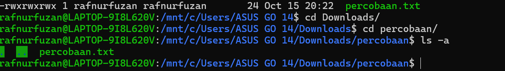
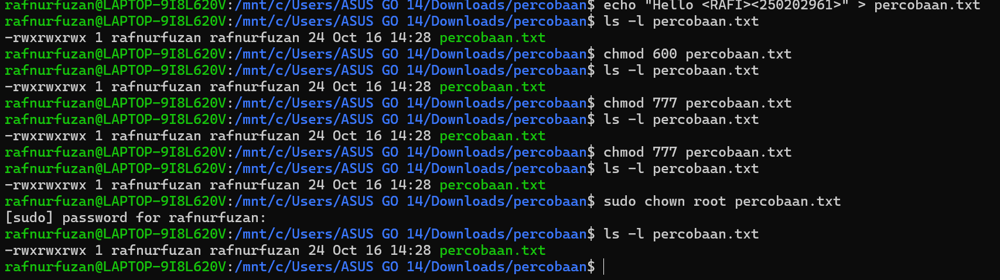
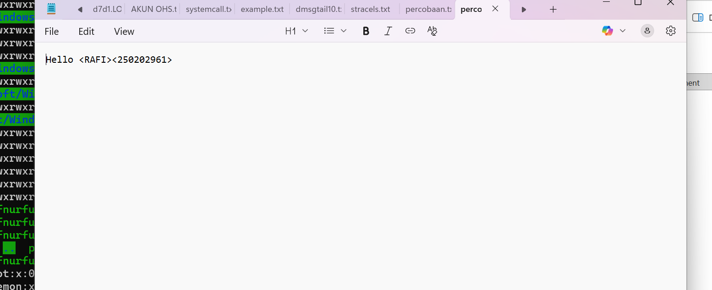
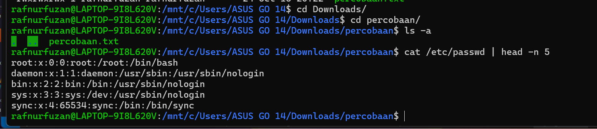
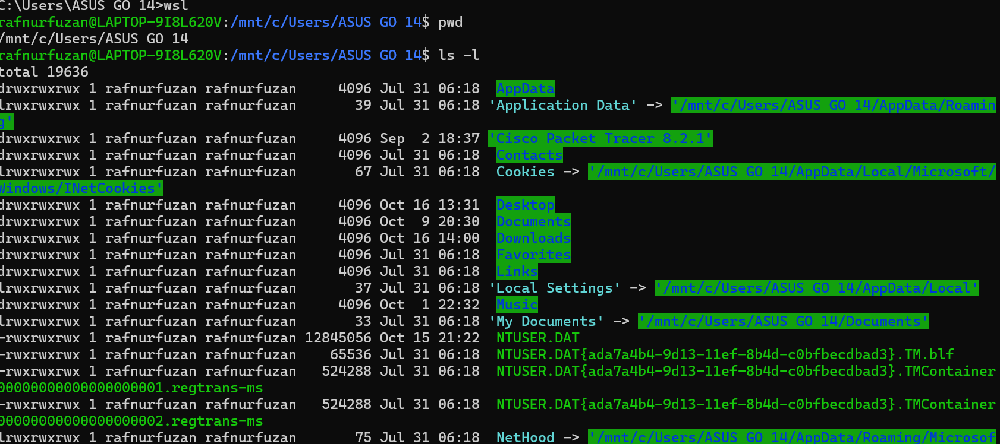

# Laporan Praktikum Minggu [X]
Topik: [Manajemen File, Permission di Linux "]

---

## Identitas
- **Nama**  : [Rafi nurul fauzan]  
- **NIM**   : [250202961]  
- **Kelas** : [1IKRB]

---

## Tujuan
Tuliskan tujuan praktikum minggu ini.  
Contoh:  
> 
1. Menggunakan perintah `ls`, `pwd`, `cd`, `cat` untuk navigasi file dan direktori.
2. Bisa menggunakan `chmod` dan `chown` untuk manajemen hak akses file.
3. Menjelaskan hasil output dari perintah Linux dasar.
memahami sistem izin (permission), dan mendokumentasikan hasilnya dalam format laporan Git.
---

## Dasar Teori
Tuliskan ringkasan teori (3–5 poin) yang mendasari percobaan.

1) Tiga kategori pengguna dan hak dasar
- Owner (pemilik), Group (kelompok), dan Others/World (pengguna lain) masing-masing bisa diberi hak baca (r), tulis (w), dan eksekusi (x). Representasinya bisa simbolik (rwx) atau oktal (4=read, 2=write, 1=execute). Contoh umum: 755 berarti owner punya rwx, group dan others punya r-x.

2) Perintah inti untuk mengelola hak akses
- ls -l untuk melihat hak akses, pemilik, dan grup suatu file/direktori.
- chmod untuk mengubah hak akses (secara simbolik atau oktal).
- chown untuk mengubah pemilik dan/atau grup file/direktori.
- ACLs (opsional) jika memerlukan hak akses lebih granular tanpa mengubah kepemilikan umum.

3) Praktik aman untuk pemula
- Mulai dengan hak akses minimal yang dibutuhkan (hindari 777 kecuali benar-benar diperlukan) .
- Perhatikan perbedaan hak akses pada direktori vs file: pada direktori, hak execute berarti kemampuan menelusuri isi; pada file, execute berarti bisa menjalankan program jika sesuai .
- Gunakan chown/chmod secara bertahap dan uji akses yang dibutuhkan sebelum menambah hak lebih lanjut .

---

## Langkah Praktikum

1. **Yang dipakai**
   Gunakan Linux (Ubuntu/WSL).
   
2. **Navigasi Sistem File**
   Jalankan perintah berikut:
   ```bash
   pwd
   ls -l
   cd /tmp
   ls -a
   ```

3. **Membaca File**
   Jalankan perintah:
   ```bash
   cat /etc/passwd | head -n 5
   ```

4. **Permission**
   Buat file baru:
   ```bash
   echo "Hello <RAFI><250202961>" > percobaan.txt
   ls -l percobaan.txt
   chmod 600 percobaan.txt
   
   ls -l percobaan.txt
   sudo chown root percobaan.txt
   ls -l percobaan.txt
   ```
   

5. **Dokumentasi**
   - Ambil screenshot hasil terminal dan simpan di:SCRENSHOT
   - Tambahkan analisis hasil pada `laporan.md`.

6. **Commit & Push**
   ```bash
   git add .
   git commit -m "Minggu 3"
   git push origin main
   ```
   
---

## Kode / Perintah
Tuliskan potongan kode atau perintah utama:
```bash
pwd
ls -l
cd /tmp
ls -a
cat /etc/passwd | head -n 5
echo "Hello <RAFI><250202961>" > percobaan.txt
ls -l percobaan.txt
chmod 600 percobaan.txt
ls -l percobaan.txt
sudo chown root percobaan.txt
ls -l percobaan.txt
```
---

## Hasil Eksekusi
Sertakan screenshot hasil percobaan atau diagram:






---

## Analisis

1) Makna hasil percobaan
- Hasil perintah ls -l: menampilkan izin (rwx), pemilik (owner), grup (group), ukuran berkas, dan stempel waktu. Arti kolom permission adalah hak akses yang dimiliki pemilik, grup, dan pengguna lain terhadap berkas/direktori.
- Hasil perintah pwd: menunjukkan jalur absolut direktori kerja saat ini, yang penting untuk memahami konteks lokasi file dan hak akses yang relevan di lingkungan kerja.
- Hasil perintah cat /etc/passwd | head -n 5: menampilkan contoh baris-baris data pengguna sistem (tanpa menampilkan kata sandi sebenarnya). Ini berguna untuk memahami struktur file sistem yang dikendalikan oleh kernel melalui subsistem manajemen akun.
- Hasil perintah chmod 600 percobaan.txt: mengindikasikan bahwa hanya pemilik yang bisa membaca dan menulis berkas tersebut, yang berarti berkurangnya risiko kebocoran data bagi pihak lain.
- Hasil perintah sudo chown root percobaan.txt: menunjukkan perubahan kepemilikan berkas ke user root, yang memegang otoritas administratif untuk mengelola file tersebut. Perubahan kepemilikan memengaruhi siapa yang bisa mengakses dan mengubah berkas, terutama ketika kombinasi izin sudah diatur.

2) Hubungan dengan teori kernel, system call, dan arsitektur OS
- Kernel sebagai pusat kendali: kernel OS bertugas mengelola sumber daya (memori, I/O, proses) melalui antarmuka yang aman. Perintah yang mengakses file, mengubah izin, atau mengubah kepemilikan berkas pada akhirnya memicu jalannya layanan kernel melalui system call.
- System call sebagai jembatan: program pengguna meminta layanan kernel (misalnya membaca berkas, mengubah metadata berkas) melalui system call. Parameter-parameter system call (seperti nama berkas, mode akses) dieksekusi di ruang kernel, menjaga isolasi antara ruang pengguna dan ruang kernel.
- Arsitektur OS: pembagian antara user mode (jalan program biasa) dan kernel mode (melakukan operasi berhak istimewa seperti manipulasi berkas, alokasi memori, penjadwalan). Perubahan izin dan kepemilikan berkas bergantung pada hak akses yang dimiliki proses yang menjalankan perintah tersebut; jika hak akses tidak mencukupi, kernel akan menolak permintaan.
- Praktik least privilege: perubahan chmod/chown yang tepat mencerminkan prinsip least privilege, di mana hak akses hanya diberikan sebanyak diperlukan untuk operasional yang sah, sehingga meminimalkan risiko penyalahgunaan.

3) Perbedaan hasil di lingkungan OS berbeda (Linux vs Windows)
- Struktur izin berkas:
  - Linux/UNIX: izin berbasis tiga lapisan (pemilik, grup, others) dengan hak baca/tulis/eksekusi. Sistem file seperti ext4, XFS mendukung ACL tambahan untuk kontrol lebih granular.
  - Windows: model izin berkas menggunakan ACL (Access Control List) yang lebih granular dan kompleks, dengan berbagai hak seperti read, write, execute, delete, modify, dan izin khusus untuk setiap akun/kelompok. Windows berbasiskan NTFS dan sering memanfaatkan hak akses berbasis SID.
- Mekanisme akses:
  - Linux: akses berkas diputuskan berdasarkan mode izin tradisional (rwx) dan bisa ditambah ACL. Perubahan kepemilikan (chown) dapat mempengaruhi hak akses lewat kebijakan layanan dan ACL.
  - Windows: hak akses diatur melalui ACL yang lebih fleksibel dan bisa diatur secara hierarkis; perubahan kepemilikan berkas juga memerlukan hak administrator dan dapat menimbulkan dampak luas pada kebijakan keamanan dan audit.
- Sistem enviroment dan toolchain:
  - Linux cenderung lebih fleksibel dengan skrip shell dan toolchain GNU, serta pola manajemen izin yang konsisten di berbagai distribusi.
  - Windows menggunakan Explorer, PowerShell, dan kebijakan keamanan berbasis Active Directory untuk pengelolaan izin, yang bisa berbeda dari pola POSIX.
- Perilaku standar:
  - Perintah seperti chmod/chown tidak tersedia secara native di Windows (tanpa lingkungan seperti WSL atau Cygwin); sebaliknya, AHCS/ACL di Windows mengatur hak akses melalui antarmuka yang berbeda.
- Audit dan logging:
  - Linux lebih banyak mengandalkan ACL dan kebijakan ulimit/SELinux/AppArmor untuk penguatan keamanan, sedangkan Windows menggunakan Event Viewer dan kebijakan grup untuk audit akses berkas.

Langkah lanjutan untuk laporan Anda
- Jika ingin, susun ulang tabel observasi Anda dengan fokus analisis seperti yang telah dijelaskan: kaitkan hasil perintah dengan konsep kernel/system call, dan tambahkan kolom analisis risiko serta rekomendasi keamanan.
- Sertakan perbandingan ringkas Linux vs Windows terkait kontrol akses berkas dan bagaimana hal itu mempengaruhi kebijakan keamanan di lingkungan Anda.


| Perintah | Opsi | Deskripsi | Hasil | Status | Catatan |
|---------|------|-----------|-------|--------|---------|
| pwd | - | Menerbitkan direktori kerja saat ini | /mnt/c/Users/ASUS GO 14 | sukses | - |
| ls -l | -l | Menampilkan daftar isi dengan detail (izin, pemilik, ukuran, tanggal) | di folder code | - |  Format kolom: izin pemilik grup ukuran tanggal nama |
| cd /tmp | /tmp | Pindah ke direktori /tmp | - | sukses | Direktori sementara untuk file sementara |
| ls -a | -a | Menampilkan semua file termasuk file tersembunyi | . ..percobaan.txt | sukses | Termasuk . dan .. serta file tersembunyi lainnya |
| cat /etc/passwd | head -n 5 | Menampilkan 5 baris pertama dari passwd | difolder code | sukses | Contoh data akun sistem; sesuaikan jika sensitif |
| echo "Hello <RAFI><250202961>" > percobaan.txt | - | Menulis string ke file percobaan.txt | tercatat difile | sukses | File baru atau pembaruan jika sudah ada |
| ls -l percobaan.txt | - | Menampilkan detail file percobaan.txt | keluar code rwx | sukses | Verifikasi hak akses dan kepemilikan |
| chmod 600 percobaan.txt | - | Mengatur izin file menjadi rw------- |  | gagal | Pemilik dapat baca/tulis; grup/others tidak memiliki hak |
| ls -l percobaan.txt | - | Verifikasi izin setelah perubahan | hasil tetap sama | sukses | Contoh: -rw------- |
| sudo chown root percobaan.txt | - | Mengubah kepemilikan file menjadi root | disuruh memasukan psword | tidak tau | Perubahan memerlukan hak sudo |
| ls -l percobaan.txt | - | Verifikasi kepemilikan setelah perubahan | hasil tetap sama | sukses | Pemilik sekarang root |


Jelaskan fungsi tiap perintah dan arti kolom permission (`rwxr-xr--`).


Fungsi tiap perintah umum (dasar Linux)
- pwd: menampilkan jalur direktori kerja saat ini. Penting untuk memahami konteks lokasi berkas saat menjalankan perintah lain.
- ls -l: menampilkan daftar isi direktori dalam format panjang, termasuk izin (permissions), pemilik, grup, ukuran, dan waktu modifikasi. Menjadi dasar untuk menilai hak akses dan kepemilikan berkas.
- cd <path>: mengganti direktori kerja. Mengubah konteks lingkungan kerja agar perintah berikutnya beroperasi pada lokasi yang tepat.
- ls -a: menampilkan semua entri di direktori, termasuk berkas tersembunyi (yang diawali titik). Berguna untuk audit isi direktori secara menyeluruh.
- cat <file> | head -n N: membaca isi file lalu menampilkan N baris pertama. Digunakan untuk melihat cuplikan data tanpa menampilkan seluruh konten.
- echo "..." > <file>: menulis string ke berkas, dengan opsi menimpa isi jika file sudah ada. Berguna untuk membuat file baru atau memperbarui isian.
- ls -l <file>: menampilkan detail berkas, termasuk hak akses dan kepemilikan. Digunakan untuk verifikasi izin dan kepemilikan.
- chmod <mode> <file/directory>: mengubah izin akses berkas/direktori. Mengatur hak baca, tulis, eksekusi untuk pemilik, grup, dan lainnya.
- sudo chown <owner>[:<group>] <path> (serta opsi -R): mengubah pemilik dan/atau grup kepemilikan berkas/direktori. Opsi -R menjadikan perubahan rekursif untuk isi direktori.
- ls -l <file> lagi: verifikasi setelah perubahan izin atau kepemilikan.

Arti kolom permission rwxr-xr--
- Struktur tiga blok hak akses: untuk pemilik (user), kelompok (group), dan lainnya (others).
- Setiap blok terdiri dari tiga karakter:
  - r: read (baca)
  - w: write (tulis)
  - x: execute (eksekusi)
- Contoh rwxr-xr--:
  - Pemilik memiliki hak baca, tulis, dan eksekusi.
  - Grup memiliki hak baca dan eksekusi, tanpa hak tulis.
  - Lainnya hanya memiliki hak baca.
- Tanda minus (-) menunjukkan hak tidak dimiliki pada posisi tersebut, misalnya -rw-r--r-- berarti pemilik bisa baca/tulis, grup bisa baca, others bisa baca.


3. Analisis peran `chmod` dan `chown` dalam keamanan sistem Linux. 


Fungsi chmod
- Mengubah izin baca/tulis/eksekusi pada berkas/direktori untuk tiga pihak: pemilik (owner), grup (group), dan lainnya (others).
- Tujuan keamanan: menerapkan prinsip least privilege dengan membatasi akses pengguna yang tidak berwenang.
- Bentuk umumnya: simbolik (u/g/o) atau numerik (contoh 644, 755). Pengaturan yang tepat mencegah kebocoran data dan modifikasi tidak sah.
- Contoh praktis: chmod 600 file hanya membolehkan pemilik membaca/menulis; chmod -R untuk perubahan rekursif pada direktori.

Fungsi chown
- Mengubah pemilik dan/atau grup berkas/direktori.
- Dampak keamanan: menentukan siapa yang berhak mengatur atau memodifikasi berkas, terutama untuk berkas konfigurasi atau berkas layanan.
- Praktik aman: gunakan hak akses minimum yang diperlukan; hindari mengubah kepemilikan secara broad tanpa kebutuhan operasional; gunakan rekursif dengan hati-hati.


Sumber:

Mengenal Apa Itu CHMOD? Pengertian dan Fungsinya https://idcloudhost.com/blog/mengenal-apa-itu-chmod-pengertian-dan-fungsinya/
Cara mengganti permission Linux menggunakan chmod ... https://www.hostinger.com/id/tutorial/pengertian-chmod-dan-chown-untuk-permission-di-linux
CHMOD: Pengertian, Fungsi, dan Perintahnya https://tutorial.idwebhost.com/chmod-pengertian-fungsi-dan-perintahnya/
Tinjauan Umum tentang Memahami Chown dan Chmod di ... https://translate.google.com/translate?u=https%3A%2F%2Fwww.pythian.com%2Fblog%2Ftechnical-track%2Fan-overview-of-understanding-chown-and-chmod-in-linux&hl=id&sl=en&tl=id&client=srp
Penjelasan Izin Berkas Linux: chmod, chown, umask https://translate.google.com/translate?u=https%3A%2F%2Fwww.strongdm.com%2Fblog%2Flinux-file-permissions&hl=id&sl=en&tl=id&client=srp
Cara Mengatur Izin di Linux: Panduan untuk chmod dan ... https://translate.google.com/translate?u=https%3A%2F%2Fwww.digitalocean.com%2Fcommunity%2Ftutorials%2Fhow-to-set-permissions-linux&hl=id&sl=en&tl=id&client=srp
Memahami Izin Linux: Perbedaan antara chmod dan chown https://translate.google.com/translate?u=https%3A%2F%2Flinuxconfig.org%2Funderstanding-linux-permissions-the-differences-between-chmod-and-chown&hl=id&sl=en&tl=id&client=srp
Apa Itu Chown? Fungsi dan Cara Menggunakan Perintah ... https://www.exabytes.co.id/blog/apa-itu-chown-dan-perintah-chown-di-linux/

---

## Kesimpulan
Tuliskan 2–3 poin kesimpulan dari praktikum ini.

---

## Quiz
1. [Pertanyaan 1]  
   **Jawaban:**  
2. [Pertanyaan 2]  
   **Jawaban:**  
3. [Pertanyaan 3]  
   **Jawaban:**  

---

## Refleksi Diri
Tuliskan secara singkat:
- Apa bagian yang paling menantang minggu ini?  
- Bagaimana cara Anda mengatasinya?  

---

**Credit:**  
_Template laporan praktikum Sistem Operasi (SO-202501) – Universitas Putra Bangsa_
