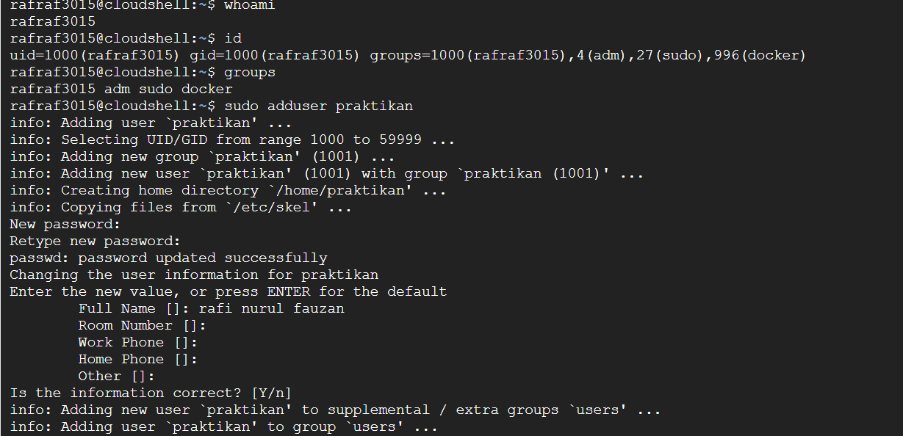
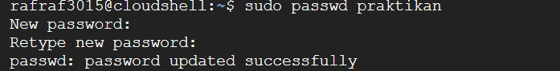
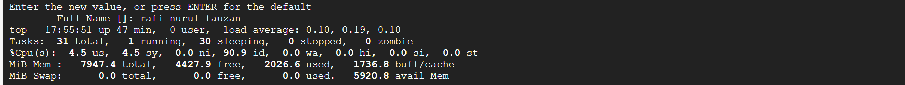
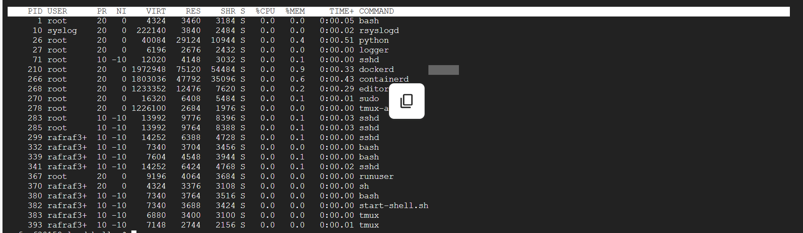
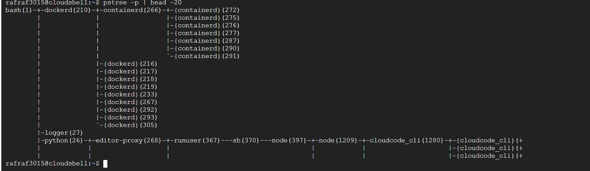

# Laporan Praktikum Minggu [X]
Topik: [Manajemen Proses dan User di Linux"]

---

## Identitas
- **Nama**  : [Rafi nurul fauzan]  
- **NIM**   : [250202961]  
- **Kelas** : [1IKRB]

---

## Tujuan
Tuliskan tujuan praktikum minggu ini.  
- Mengelola user, group dan serta hak akses pengguna.  
- Menampilkan, menghentikan, dan mengontrol proses yang sedang berjalan. 
---

## Dasar Teori
- Sistem pengelolaan user dan grup: Linux mengelompokkan pengguna ke dalam user ID (UID) dan grup ID (GID). Setiap file dan proses memiliki kepemilikan (owner) dan grup, sehingga hak akses dapat dikendalikan secara granular melalui izin file dan ACL. Ini membantu menjaga keamanan serta pengelolaan akses secara terpusat melalui perintah seperti useradd/usermod/groupadd. [2][1]

- Hierarki hak akses dan autentikasi: Sistem menggunakan kombinasi user login, password, serta kemampuan sudo untuk memberikan hak istimewa sementara. Pengaturan sudoers memungkinkan pembatasan perintah yang bisa dijalankan sebagai root, sehingga akses administratif tidak diberikan secara langsung kepada semua pengguna. [2]

- Manajemen proses inti OS: Proses adalah unit eksekusi yang berjalan di kernel; Linux mendukung multiprogramming dan scheduling untuk membagi waktu CPU antar proses. Pemahaman dasar seperti status proses (running, sleeping, zombie), prioritas, dan penanganan I/O sangat penting untuk optimasi performa sistem. [9][7]

- Peran grup untuk manajemen hak akses: Grup memungkinkan menerapkan hak akses secara kolektif ke beberapa user tanpa menyetel izin satu per satu. Grup juga sering dipakai oleh layanan atau aplikasi (misalnya database/web server) untuk menjalankan layanan dengan hak akses yang sesuai.

sumber:

Manajemen User di Linux: Tips Aman yang Jarang Dipakai https://www.idn.id/manajemen-user-di-linux-tips-aman-yang-jarang-dipakai/

Manajemen User Linux: Perintah Penting yang Wajib Tahu https://www.idn.id/manajemen-user-linux-perintah-penting-yang-wajib-tahu/

Manajemen Paket dan User Permission di Linux - JocoDEV https://jocodev.id/manajemen-paket-dan-user-permission-di-linux/

Laporan Ke 2 Linux Command Dan User Manajemen ... https://id.scribd.com/doc/182274416/Laporan-Ke-2-Linux-Command-Dan-User-Manajemen-1107008-LUKMANUL-HAKIM-SOJ

Manajemen proses Linux dengan command line https://www.hostinger.com/id/tutorial/manajemen-proses-linux-dengan-command-line

Praktikum 4 Proses dan Manajemen Proses https://raniadwitry.blogspot.com/2020/10/blog-post.html

Analisis Manajemen Proses pada Sistem Operasi Linux https://journal.arteii.or.id/index.php/Merkurius/article/download/615/878/3305

Manajemen User dan Sistem linux - Berbagi Bersama https://irziqamdiken.wordpress.com/2012/04/18/manajemen-user-dan-sistem-linux/

Manajemen Proses Pada LINUX (Ubuntu) | PDF https://id.scribd.com/doc/309245462/Manajemen-Proses-Pada-LINUX-ubuntu

Praktikum 11 Manajemen User dan Group https://raniadwitry.blogspot.com/2020/12/praktikum-11-manajemen-user-dan-group.html

---

## Langkah Praktikum
1. gunakan linux
2. Jalankan perintah berikut:
   ```bash
   whoami
   id
   groups
   ```
   - Jelaskan setiap output dan fungsinya.  
   - Buat user baru (jika memiliki izin sudo):
     ```bash
     sudo adduser praktikan
     sudo passwd praktikan
     ```
   - Uji login ke user baru.
   ```bash
   ps aux | head -10
   top -n 1
   ```
   - Jelaskan kolom penting seperti PID, USER, %CPU, %MEM, COMMAND.

     ```bash
   sleep 1000 & ps aux | grep sleep
     ```
   - Catat PID proses `sleep`.  
   - Hentikan proses:
     ```bash
     kill <PID>
     ```
   - Pastikan proses telah berhenti dengan `ps aux | grep sleep`.

```bash
   pstree -p | head -20
   ```
   - Amati hierarki proses dan identifikasi proses induk (`init`/`systemd`).  
   - Catat hasilnya dalam laporan.

3. lalu up ke git hub 


---

## Kode / Perintah
Tuliskan potongan kode atau perintah utama:
```bash
whoami
id
groups
sudo adduser praktikan
sudo passwd praktikan
ps aux | head -10
top -n 1
sleep 1000 &
 ps aux | grep sleep
kill <PID>
pstree -p | head -20

```

---

## Hasil Eksekusi
Sertakan screenshot hasil percobaan atau diagram:







---

## Analisis
Hasil percobaan

 menunjukkan pengelolaan user dan proses di Linux yang sesuai dengan teori sistem operasi. Perintah seperti whoami, id, dan groups menampilkan identitas user dan hak akses berdasarkan UID, GID, dan grup, yang dikelola oleh kernel melalui system call untuk kontrol akses.

hubungan hasil dengan teori (fungsi kernel, system call, arsitektur OS).

Proses baru dibuat dan dijalankan (mis. sleep 1000 &) dengan PID unik, membuktikan manajemen proses oleh kernel yang mengatur penjadwalan dan resource. Perintah kill <PID> mengirim sinyal untuk mengontrol proses, memperlihatkan interaksi user space dengan kernel.

Apa perbedaan hasil di lingkungan OS berbeda (Linux vs Windows)?

Perbedaan di Windows, meskipun ada konsep PID dan proses, manajemen user dan proses memakai model akses berbasis token dan antarmuka berbeda (Task Manager, PowerShell), dengan eskalasi hak yang diatur UAC, sedangkan Linux menggunakan sistem file permission dan grup.

Singkatnya, percobaan menunjukkan kerja kernel dalam manajemen user dan proses, penggunaan system call untuk interaksi, dan perbedaan model keamanan antara Linux dan Windows. Semua ini menegaskan arsitektur OS yang memisahkan user space dan kernel space untuk keamanan dan stabilitas 


Eksperimen 1 – Identitas User

1. Perintah `whoami`: Menampilkan username dari user yang sedang login dan aktif menjalankan shell.
2. Perintah `id`: Menampilkan informasi user yang sedang aktif, termasuk user ID (uid), group ID (gid), dan grup-grup yang diikuti.
3. Perintah `groups`: Menampilkan daftar grup yang user saat ini ikuti.

Fungsi output:
- `whoami`: Mengetahui user yang aktif.
- `id`: Mengetahui detail identitas user dan grup.
- `groups`: Melihat grup yang user menjadi anggotanya.

Selanjutnya, buat user baru `praktikan` dengan `sudo adduser praktikan` dan set password dengan `sudo passwd praktikan`. Uji login ke user `praktikan` untuk memastikan user berhasil dibuat dan dapat digunakan.

Eksperimen 2 – Monitoring Proses

1. `ps aux | head -10`: Menampilkan 10 baris pertama dari daftar proses yang berjalan di sistem.
2. `top -n 1`: Menampilkan snapshot status proses dan penggunaan sumber daya sistem (CPU, memori).

Kolom penting:
- `PID`: Process ID proses.
- `USER`: User pemilik proses.
- `%CPU`: Persentase penggunaan CPU oleh proses.
- `%MEM`: Persentase penggunaan memori oleh proses.
- `COMMAND`: Nama atau perintah yang menjalankan proses.


Eksperimen 3 – Kontrol Proses

1. Menjalankan perintah di background `sleep 1000 &` yang menjalankan proses tidur selama 1000 detik.
2. Gunakan `ps aux | grep sleep` untuk mendapatkan PID proses `sleep`.
3. Hentikan proses dengan perintah `kill <PID>` menggantikan `<PID>` dengan PID proses yang didapat.
4. Pastikan proses berhenti dengan menjalankan ulang `ps aux | grep sleep`.

 Eksperimen 4 – Analisis Hierarki Proses

Jalankan perintah `pstree -p | head -20` untuk melihat struktur hierarki 20 proses pertama sebagai pohon proses.

- Root dari proses biasanya adalah `init` atau `systemd`.
- Setiap proses bisa memiliki anak proses yang ditampilkan sebagai cabang di bawah induk.
- Perintah ini memudahkan pemahaman hubungan induk-anak dari proses-proses berjalan di sistem.


Dengan langkah ini Anda dapat membuat laporan lengkap tentang user, monitoring proses, kontrol proses, dan analisis hierarki proses. Jangan lupa melakukan `git add .`, `git commit -m "Minggu 4 - Manajemen Proses & User"`, dan `git push origin main` sesuai instruksi.


TUGAS

1. Dokumentasikan hasil semua perintah dan jelaskan fungsi tiap perintah.  

| Perintah        | Fungsi                                                                                   |
|-----------------|------------------------------------------------------------------------------------------|
| whoami        | Menampilkan nama user yang sedang aktif di terminal.                                    |
| id            | Menampilkan user ID (UID), group ID (GID), dan grup yang diikuti user tersebut.         |
| groups        | Menampilkan daftar grup yang diikuti user saat ini.                                    |
| sudo adduser  | Menambahkan user baru ke sistem (perlu hak sudo).                                       |
| sudo passwd   | Mengubah password user baru.                                                            |
| ps aux        | Menampilkan daftar semua proses yang berjalan pada sistem.                              |
| top -n 1      | Menampilkan snapshot proses yang berjalan beserta penggunaan CPU dan memori.            |
| sleep 1000 &  | Menjalankan proses sleep selama 1000 detik di background.                               |
| kill <PID>    | Mengirim sinyal ke proses tertentu berdasarkan PID untuk mengontrol atau menghentikannya.|
| pstree -p     | Menampilkan pohon hierarki proses yang berjalan beserta PID-nya.                        |


2. Gambarkan hierarki proses dalam bentuk diagram pohon (`pstree`) di laporan.  

Gambaran pohon proses dari hasil pstree -p | head -20 yang menunjukkan hubungan induk-anak proses, dimana bash(1) adalah root shell dan memiliki beberapa proses daemon seperti dockerd dan proses anak lainnya yang aktif.


bash(1)-+-dockerd(208)-+-containerd(235)-+-{containerd}(251)
        |              |                 |-{containerd}(252)
        |              |                 |-{containerd}(253)
        |              |                 |-{containerd}(254)
        |              |                 |-{containerd}(259)
        |              |                 |-{containerd}(260)
        |              |                 `-{containerd}(263)
        |              |-{dockerd}(214)
        |              |-{dockerd}(215)
        |              |-{dockerd}(216)
        |              |-{dockerd}(217)
        |              |-{dockerd}(231)
        |              |-{dockerd}(233)
        |              |-{dockerd}(265)
        |              |-{dockerd}(264)
        |              `-{dockerd}(442)
        |-logger(27)
        |-python(26)-+-editor-proxy(245)-+-runuser(474)---sh(475)---node(488) ...


3. Apa perbedaan hasil di lingkungan OS berbeda (Linux vs Windows)?

Manajemen user mengatur siapa yang dapat mengakses sistem dan menjalankan perintah tertentu melalui konsep UID, GID, dan grup. Hak akses ini membatasi operasi yang boleh dilakukan agar tidak sembarangan user bisa melakukan tindakan berbahaya.  
Penggunaan grup dan sudo untuk eskalasi hak memungkinkan audit dan kontrol yang baik untuk menjaga keamanan sistem, meminimalisir risiko akses tidak sah, serta menjaga stabilitas sistem dengan membatasi hak administratif pada user tertentu saja.


---

## Kesimpulan

- Proses init atau systemd adalah proses pertama yang dijalankan kernel Linux saat booting. init adalah versi lama yang menjalankan layanan secara berurutan, sedangkan systemd adalah versi modern yang menjalankan layanan secara paralel untuk efisiensi dan manajemen layanan yang lebih baik.

- Perintah kill digunakan untuk mengirim sinyal ke proses berdasarkan PID, sedangkan killall mengirim sinyal ke semua proses dengan nama tertentu. kill lebih spesifik, killall lebih praktis untuk menghentikan banyak proses sekaligus.

- User root memiliki hak istimewa karena memiliki kontrol penuh atas seluruh sistem, termasuk konfigurasi, manajemen layanan, dan pengaturan keamanan. Hak ini diperlukan untuk administrasi sistem, tapi harus digunakan dengan hati-hati.

- Manajemen user dan grup pada Linux terkait erat dengan keamanan karena menentukan hak akses dan kontrol terhadap sumber daya sistem, sehingga membatasi operasi yang dapat dilakukan oleh pengguna sesuai dengan kebijakan keamanan.

- Saat kill PID gagal, kemungkinan karena proses tersebut tidak merespon sinyal biasa, proses milik user lain, atau proses dalam status khusus. Menggunakan sinyal paksa (kill -9) dan sudo bisa membantu, namun untuk proses dalam status uninterruptible sleep perlu penanganan khusus.

- Perintah-perintah praktikum seperti whoami, id, groups, ps aux, top, kill, dan pstree membantu memahami manajemen proses dan user, serta memantau dan mengendalikan proses yang berjalan dalam sistem Linux secara efektif.

---

## Quiz
1. [Apa fungsi dari proses `init` atau `systemd` dalam sistem Linux?]  
- Init: proses induk pertama yang dijalankan kernel saat boot. Ia membentuk pohon proses dan meminang layanan inti secara berurutan pada sistem yang lebih lama.

- systemd: versi modern dari init yang mengelola booting paralel, unit layanan, dependensi antar layanan, pemantauan proses, logging, dan banyak fitur manajemen sistem lainnya. Intinya, mengorkestrasi startup, pengelolaan layanan, dan menjaga sistem tetap berjalan. 

2. [Apa perbedaan antara `kill` dan `killall`? ]  
- kill: mengirimkan sinyal ke satu proses berdasarkan PID.

- killall: mengirimkan sinyal ke semua proses yang memiliki nama sama (bisa juga dibatasi lewat opsi seperti -u untuk user). Root bisa menghentikan proses milik siapa saja; pengguna biasa hanya bisa menghentikan proses milik dirinya sendiri (kecuali memakai hak istimewa).

3. [Mengapa user `root` memiliki hak istimewa di sistem Linux?]  
Root memiliki kendali penuh atas sistem: bisa membaca/mengubah file sistem, mengelola layanan, mengubah konfigurasi keamanan, dan melakukan tindakan yang berpotensi merusak kalau salah. Hak istimewa ini diperlukan untuk administrasi, perbaikan masalah, dan pemulihan sistem. Karena tingkat aksesnya tinggi, tindakan root harus dilakukan dengan kehati-hatian dan diaudit.

---

## Refleksi Diri
Tuliskan secara singkat:
- Apa bagian yang paling menantang minggu ini? 
mengerikan krna bisa merusak sistem laptop 
- Bagaimana cara Anda mengatasinya?  
krna berpotensi mnegerikan saya mengunakan shellcloud yang lebih aman
---

**Credit:**  
_Template laporan praktikum Sistem Operasi (SO-202501) – Universitas Putra Bangsa_
