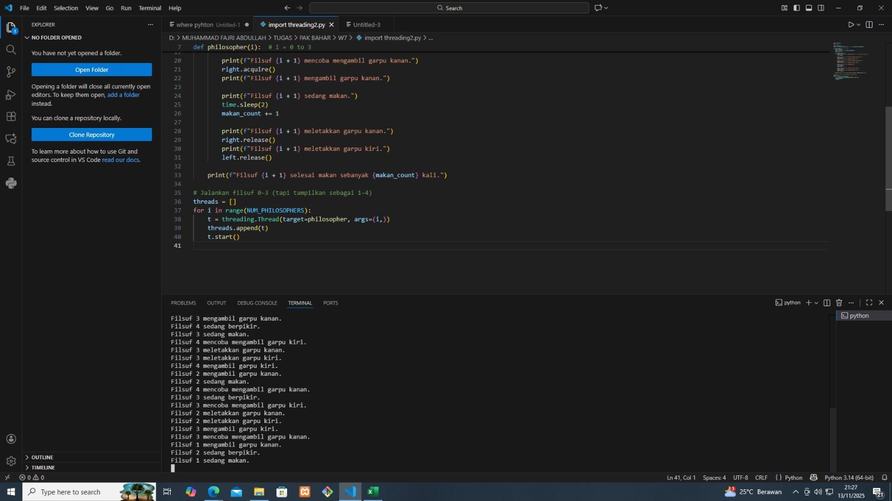

# Laporan Praktikum Minggu [X]
Topik: [Sinkronisasi Proses dan Masalah Deadlock]

---

## Identitas
- **Nama**  : [Rafi nurul fauzan]  
- **NIM**   : [250202961]  
- **Kelas** : [1IKRB]

---

## Tujuan
Tuliskan tujuan praktikum minggu ini.  
Contoh:  
1. Mengidentifikasi empat kondisi penyebab deadlock (*mutual exclusion, hold and wait, no preemption, circular wait*).  
2. Menjelaskan mekanisme sinkronisasi menggunakan *semaphore* atau *monitor*.  
3. Menganalisis dan memberikan solusi untuk kasus deadlock.  
4. Berkolaborasi dalam tim untuk menyusun laporan analisis.  
5. Menyajikan hasil studi kasus secara sistematis.  

---

## Dasar Teori

- Dining Philosophers adalah contoh masalah klasik dalam sinkronisasi dan konkurensi proses yang menggambarkan pembagian sumber daya terbatas serta risiko deadlock dan starvation.

- Dalam model ini, lima filosof duduk mengelilingi meja bundar dengan satu garpu (sumpit) di antara setiap dua filosof. Setiap filosof perlu dua garpu untuk makan.

- Filosof menjalankan siklus berulang antara berpikir dan makan. Untuk makan, mereka harus mengambil dua garpu di kiri dan kanan secara eksklusif.

- Deadlock terjadi saat semua filosof mengambil garpu sebelah kiri lalu menunggu garpu sebelah kanan yang dipegang orang lain, sehingga semua proses saling menunggu tanpa ada yang makan.

- Pencegahan deadlock dilakukan dengan mekanisme sinkronisasi seperti semaphore atau mutex yang mengontrol akses garpu dan membatasi jumlah filosof yang makan bersamaan, serta pengaturan urutan pengambilan garpu.


Kutipan:
1. Masalah Filsuf Makan Malam https://translate.google.com/translate?u=https%3A%2F%2Fwww.geeksforgeeks.org%2Foperating-systems%2Fdining-philosophers-problem%2F&hl=id&sl=en&tl=id&client=srp

2. The Dining-Philosopher Problem | PDF https://id.scribd.com/doc/269635673/The-Dining-philosopher-Problem

3. 8.5. Masalah dan Kebuntuan Filsuf Makan Malam - Â https://translate.google.com/translate?u=https%3A%2F%2Fw3.cs.jmu.edu%2Fkirkpams%2FOpenCSF%2FBooks%2Fcsf%2Fhtml%2FDiningPhil.html&hl=id&sl=en&tl=id&client=srp

4. simulasi pencegahan deadlock menggunakan dining ... https://repository.uin-suska.ac.id/678/1/2011_2011189.pdf

5. Makalah Dining Philosophers Problem | PDF https://id.scribd.com/document/409115616/Makalah-Dining-Philosophers-Problem

6. Menguasai Konkurensi dengan Masalah Filsuf Makan https://translate.google.com/translate?u=https%3A%2F%2Fbrandonkindred.medium.com%2Fmastering-concurrency-with-the-dining-philosopher-problem-8445920f7863&hl=id&sl=en&tl=id&client=srp

7. Masalah Filsuf Makan Malam - Tinjauan Umum https://translate.google.com/translate?u=https%3A%2F%2Fwww.sciencedirect.com%2Ftopics%2Fcomputer-science%2Fdining-philosophers-problem&hl=id&sl=en&tl=id&client=srp

8. Masalah Filsuf Makan Malam https://translate.google.com/translate?u=https%3A%2F%2Fwww.studytonight.com%2Foperating-system%2Fdining-philosophers-problem&hl=id&sl=en&tl=id&client=srp

9. Sistem operasi masalah filsuf makan | PPTX https://translate.google.com/translate?u=https%3A%2F%2Fwww.slideshare.net%2Fslideshow%2Fdining-philosopher-problem-operating-system%2F248885255&hl=id&sl=en&tl=id&client=srp

---

## Langkah Praktikum

1. Persiapan Tim
   - Bentuk kelompok beranggotakan 3–4 orang.  
   - Tentukan ketua dan pembagian tugas (analisis, implementasi, dokumentasi).

2. Eksperimen 1 – Simulasi Dining Philosophers (Deadlock Version)
   - Implementasikan versi sederhana dari masalah *Dining Philosophers* tanpa mekanisme pencegahan deadlock.  
   - Contoh pseudocode:
     ```text
     while true:
       think()
       pick_left_fork()
       pick_right_fork()
       eat()
       put_left_fork()
       put_right_fork()
     ```
   - Jalankan simulasi atau analisis alur (boleh menggunakan pseudocode atau diagram alur).  
   - Identifikasi kapan dan mengapa deadlock terjadi.

3. Eksperimen 2 – Versi Fixed (Menggunakan Semaphore / Monitor)
   - Modifikasi pseudocode agar deadlock tidak terjadi, misalnya:
     - Menggunakan *semaphore (mutex)* untuk mengontrol akses.
     - Membatasi jumlah filosof yang dapat makan bersamaan (max 4).  
     - Mengatur urutan pengambilan garpu (misal, filosof terakhir mengambil secara terbalik).  
   - Analisis hasil modifikasi dan buktikan bahwa deadlock telah dihindari.

4. Eksperimen 3 – Analisis Deadlock
   - Jelaskan empat kondisi deadlock dari versi pertama dan bagaimana kondisi tersebut dipecahkan pada versi fixed.  
   - Sajikan hasil analisis dalam tabel seperti contoh berikut:

     | Kondisi Deadlock | Terjadi di Versi Deadlock | Solusi di Versi Fixed |
     |------------------|---------------------------|------------------------|
     | Mutual Exclusion | Ya (satu garpu hanya satu proses) | Gunakan semaphore untuk kontrol akses |
     | Hold and Wait | Ya | Hindari proses menahan lebih dari satu sumber daya |
     | No Preemption | Ya | Tidak ada mekanisme pelepasan paksa |
     | Circular Wait | Ya | Ubah urutan pengambilan sumber daya |

5. Eksperimen 4 – Dokumentasi
   - Simpan semua diagram, screenshot simulasi, dan hasil diskusi di:
     ```
     praktikum/week7-concurrency-deadlock/screenshots/
     ```
   - Tuliskan laporan kelompok di `laporan.md` (format IMRaD singkat: *Pendahuluan, Metode, Hasil, Analisis, Diskusi*).

6. Commit & Push
   ```bash
   git add .
   git commit -m "Minggu 7 - Sinkronisasi Proses & Deadlock"
   git push origin main
   ```

---

## Kode / Perintah
Tuliskan potongan kode atau perintah utama:
```bash

import threading
import time

N = 5  # jumlah filosof (1 sampai 5)
forks = [threading.Semaphore(1) for _ in range(N)]
max_dining = threading.Semaphore(N - 1)  # maksimal 4 filosof makan bersamaan

def philosopher(i):
    name = f"Filosof {i+1}"  # tampilkan Filosof 1–5
    while True:
        print(f"{name} sedang berpikir...")
        time.sleep(1)

        max_dining.acquire()

        if i == N - 1:
            # Filosof terakhir (Filosof 5) ambil garpu kanan dulu
            forks[(i + 1) % N].acquire()
            forks[i].acquire()
        else:
            # Filosof lain ambil garpu kiri dulu
            forks[i].acquire()
            forks[(i + 1) % N].acquire()

        print(f"{name} mulai makan...")
        time.sleep(2)

        # selesai makan, letakkan garpu
        forks[i].release()
        forks[(i + 1) % N].release()
        max_dining.release()

        print(f"{name} selesai makan.")

# buat thread untuk setiap filosof
threads = []
for i in range(N):
    t = threading.Thread(target=philosopher, args=(i,))
    threads.append(t)
    t.start()

for t in threads:
    t.join()

```

---

## Hasil Eksekusi
Sertakan screenshot hasil percobaan atau diagram:




---

## Analisis


Ketua          : Andri Dwi Yuliyanto (250202976)

Implementasi   : Andri Dwi Yuliyanto (250202976)

Analisis       : Rafi Nurul Fauzan (250202961)

Dokumentasi    : Muhammad Fajri Abdullah (250202979)


Analisis Versi Deadlock dan Versi Fixed Dining Philosophers

Versi Deadlock

1. Filosof selalu ambil garpu kiri lalu garpu kanan.
2. Jika semua filosof ambil garpu kiri secara bersamaan, mereka akan tunggu garpu kanan yang sedang dipegang oleh filosofi lain.Terjadi circular wait dan semua stuck (deadlock).
3. Tidak ada filosof yang dapat makan karena saling tunggu.

Versi Fixed (Bebas Deadlock)

1. Gunakan mekanisme sinkronisasi, misalnya semaphore atau mutex.
2. Dibatasi jumlah filosof yang boleh makan bersama, misal maksimal 4 dari 5 filosofi.
3. Filosof terakhir ambil garpu dengan urutan terbalik (kanan dulu, baru kiri) untuk cegah circular wait.
4. Filosof hanya ambil garpu jika kedua garpu tersedia. 
5. Deadlock dicegah karena setidaknya satu filosof dapat makan dan melepaskan garpu sehingga siklus berjalan.


Eksperimen 1 – Simulasi Dining Philosophers (Deadlock Version)

Pseudocode Deadlock Version

```pseudo
while true:
    think()
    pick_left_fork()
    pick_right_fork()
    eat()
    put_left_fork()
    put_right_fork()
```

Analisis Deadlock
Deadlock terjadi saat semua filosofi ambil garpu kiri mereka tapi menunggu garpu kanan yang sedang dipegang filosof lain. Maka semua filosofi stuck saling tunggu garpu satu sama lain, tidak ada yang bisa makan, lalu jadilah kondisi deadlock.


Eksperimen 2 – Versi Fixed (Menggunakan Semaphore)


Modifikasi Pseudocode

```pseudo
semaphore max_dining = 4

while true:
    think()
    wait(max_dining)           # Batasi max filosof yang makan bersamaan
    if id_filosof == N:        # Filosof terakhir mengambil garpu secara terbalik
        pick_right_fork()
        pick_left_fork()
    else:
        pick_left_fork()
        pick_right_fork()
    eat()
    put_left_fork()
    put_right_fork()
    signal(max_dining)
```

Analisis hasil:
- Maksimal 4 filosof makan bersamaan, cegah semuanya ambil garpu dan tunggu.
- Filosof terakhir ubah urutan pengambilan garpu, lalu hilangkan circular wait.
- Dengan semaphore, mutual exclusion tetap terjaga.
- Deadlock tidak terjadi karena semua empat kondisi deadlock dicegah.


Eksperimen 3 – Analisis Deadlock dalam Tabel

| Kondisi Deadlock     | Terjadi di Versi Deadlock | Solusi di Versi Fixed                                              |
|----------------------|---------------------------|-------------------------------------------------------------------|
| Mutual Exclusion      | Ya                        | Gunakan semaphore untuk mengontrol akses garpu                    |
| Hold and Wait        | Ya                        | Batasi jumlah filosof yang makan bersamaan (semaphore max_dining)|
| No Preemption        | Ya                        | Filosof melepaskan garpu secara sukarela setelah makan            |
| Circular Wait        | Ya                        | Filosof terakhir mengambil garpu secara terbalik                  |

---

## Kesimpulan

1. Masalah Dining Philosophers menggambarkan tantangan sinkronisasi dalam akses sumber daya bersama yang terbatas, yang bisa mengakibatkan deadlock jika tidak ada mekanisme pengendalian akses.

2. Deadlock terjadi ketika semua filosof mengambil satu garpu dan menunggu garpu lainnya secara bersamaan, sehingga tidak ada proses yang dapat melanjutkan.

3. Pencegahan deadlock dapat dilakukan dengan menggunakan semaphore atau mutex untuk atur akses garpu, membatasi jumlah filosof yang makan bersamaan, dan ubah urutan ambil garpu guna menghindari circular wait.

---

## Quiz
1. [Sebutkan empat kondisi utama penyebab deadlock]  
   Empat kondisi utama penyebab deadlock: mutual exclusion, hold and wait, no preemption, circular wait.
2. [Mengapa sinkronisasi diperlukan dalam sistem operasi?]  
   Sinkronisasi diperlukan untuk mengatur akses sumber daya bersama agar proses tidak saling konflik atau mengalami deadlock.
3. [Jelaskan perbedaan antara *semaphore* dan *monitor*.]  
   Semaphore menggunakan counter dengan operasi wait/signal eksplisit, sedangkan monitor adalah abstraksi sinkronisasi yang otomatis mengatur akses dan kondisi.  

---

## Refleksi Diri
Tuliskan secara singkat:
- Apa bagian yang paling menantang minggu ini?  
menjalin kerja sama antar tim
- Bagaimana cara Anda mengatasinya?  
saling komunikasi dan belajar dari kesalahan
---

**Credit:**  
_Template laporan praktikum Sistem Operasi (SO-202501) – Universitas Putra Bangsa_
